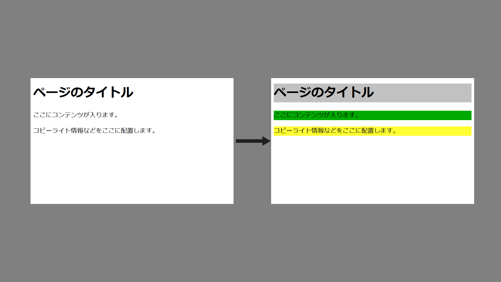
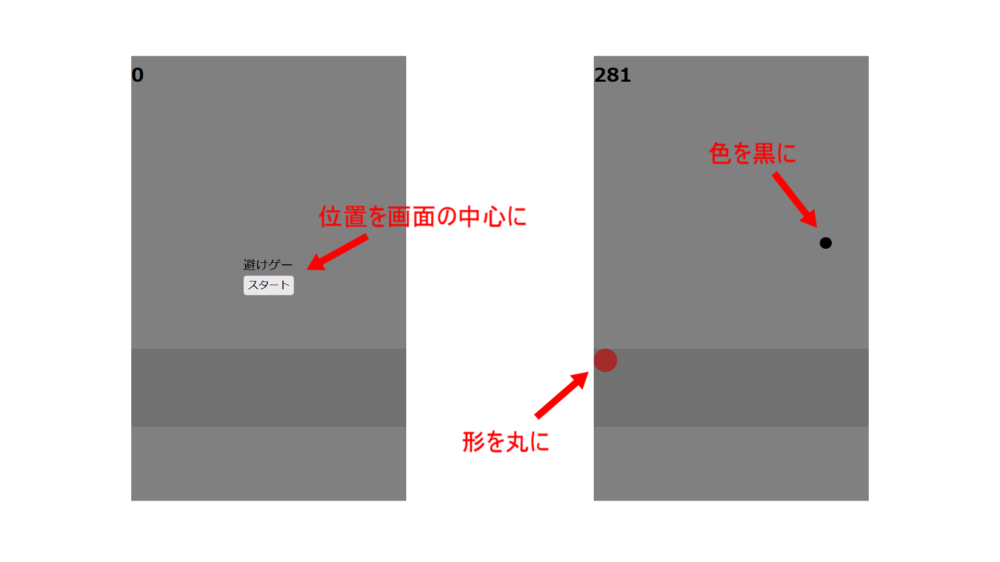

## 概要

### 前回の復習

- HTMLのタグについて学んだ

### 今回の講義の達成目標

<div class="note type-intro">
達成目標

CSSの基本的な記述方法を学ぼう。

CSSを使ってHTMLのスタイルを変更しよう。

セレクタの使い方を理解しよう。

レイアウトの基本を学ぼう。

</div>

## はじめに

- 今回は、CSSの基礎について学ぶ。
- CSSは、HTMLの要素を装飾し、レイアウトを整えるためのスタイルシート言語である。
- ひとまず、CSSを使って基本的なスタイルを設定してみよう。

## CSSの基本

### CSSとは

- CSS（Cascading Style Sheets）は、HTML要素のスタイルを定義するための言語である。色、フォント、レイアウトなどを指定できる。



- このようにページを装飾することができる。

- 他にも、形の変更や大きさ、配置する場所も決められる。



- 制作するゲーム画面でもこのような感じで使われている。

## CSSの記述方法

- CSSの記述方法には主に3つの方法がある。

1. インラインスタイル
2. 内部スタイルシート
3. 外部スタイルシート


### インラインスタイル

- インラインスタイルは、HTMLタグのstyle属性に直接CSSを記述する方法。

```html{.numberLines caption="example.html"}
<p style="color: red;">これは赤いテキストです。</p>
```

<iframe height="300" style="width: 100%;" scrolling="no" title="css0" src="https://codepen.io/YasaiRa-men/embed/XWwvXLQ?default-tab=html%2Cresult&editable=true" frameborder="no" loading="lazy" allowtransparency="true" allowfullscreen="true">
  See the Pen <a href="https://codepen.io/YasaiRa-men/pen/XWwvXLQ">
  css0</a> by バナナフライ (<a href="https://codepen.io/YasaiRa-men">@YasaiRa-men</a>)
  on <a href="https://codepen.io">CodePen</a>.
</iframe>

### 内部スタイルシート

- 内部スタイルシートは、HTMLファイルの`<head>`セクション内に`<style>`タグを使ってCSSを記述する方法。

```html{.numberLines caption="example.html"}
<!DOCTYPE html>
<html>
<head>
  <style>
    p {
      color: blue;
    }
  </style>
</head>
<body>
  <p>これは青いテキストです。</p>
</body>
</html>
```

<iframe height="300" style="width: 100%;" scrolling="no" title="css1" src="https://codepen.io/YasaiRa-men/embed/abredge?default-tab=html%2Cresult&editable=true" frameborder="no" loading="lazy" allowtransparency="true" allowfullscreen="true">
  See the Pen <a href="https://codepen.io/YasaiRa-men/pen/abredge">
  css1</a> by バナナフライ (<a href="https://codepen.io/YasaiRa-men">@YasaiRa-men</a>)
  on <a href="https://codepen.io">CodePen</a>.
</iframe>

### 外部スタイルシート

- 外部スタイルシートは、別のCSSファイルを作成し、それをHTMLファイルにリンクする方法。

- まず、styles.cssという名前のファイルを作成する。

```css{.numberLines caption="style.css"}
/* styles.css */
p {
  color: green;
}
```

- 次に、HTMLファイルでそのCSSファイルをリンクする。

```html{.numberLines caption="example.html"}
<!DOCTYPE html>
<html>
<head>
  <link rel="stylesheet" type="text/css" href="style.css">
</head>
<body>
  <p>これは緑のテキストです。</p>
</body>
</html>
```

<iframe height="300" style="width: 100%;" scrolling="no" title="css3" src="https://codepen.io/YasaiRa-men/embed/JjqgGgj?default-tab=html%2Cresult&editable=true" frameborder="no" loading="lazy" allowtransparency="true" allowfullscreen="true">
  See the Pen <a href="https://codepen.io/YasaiRa-men/pen/JjqgGgj">
  css3</a> by バナナフライ (<a href="https://codepen.io/YasaiRa-men">@YasaiRa-men</a>)
  on <a href="https://codepen.io">CodePen</a>.
</iframe>

## セレクタ

- セレクタは、どのHTML要素にスタイルを適用するかを指定するためのもの。

### タイプセレクタ

- 要素の種類を指定するセレクタ。

```html{.numberLines caption="example.html"}
<style>
p {
  color: purple;
}
</style>

<p>むらさき！！！<p>
```

<iframe height="300" style="width: 100%;" scrolling="no" title="css4" src="https://codepen.io/YasaiRa-men/embed/oNRKbKj?default-tab=html%2Cresult&editable=true" frameborder="no" loading="lazy" allowtransparency="true" allowfullscreen="true">
  See the Pen <a href="https://codepen.io/YasaiRa-men/pen/oNRKbKj">
  css4</a> by バナナフライ (<a href="https://codepen.io/YasaiRa-men">@YasaiRa-men</a>)
  on <a href="https://codepen.io">CodePen</a>.
</iframe>

### クラスセレクタ

- クラス属性を持つ要素を指定するセレクタ。クラス名はピリオド（.）を使って指定する。

```html{.numberLines caption="example.html"}
<style>
.text-red {
  color: red;
}
</style>

<p class="text-red">これは赤いテキストです。</p>
```

<iframe height="300" style="width: 100%;" scrolling="no" title="css5" src="https://codepen.io/YasaiRa-men/embed/YzbmwmW?default-tab=html%2Cresult&editable=true" frameborder="no" loading="lazy" allowtransparency="true" allowfullscreen="true">
  See the Pen <a href="https://codepen.io/YasaiRa-men/pen/YzbmwmW">
  css5</a> by バナナフライ (<a href="https://codepen.io/YasaiRa-men">@YasaiRa-men</a>)
  on <a href="https://codepen.io">CodePen</a>.
</iframe>

### IDセレクタ

- ID属性を持つ要素を指定するセレクタ。ID名はハッシュ記号（#）を使って指定する。

```html{.numberLines caption="example.html"}
<style>
#main-heading {
  color: blue;
}
</style>

<h1 id="main-heading">これは青い見出しです。</h1>
```

<iframe height="300" style="width: 100%;" scrolling="no" title="css6" src="https://codepen.io/YasaiRa-men/embed/GRaVoVW?default-tab=html%2Cresult&editable=true" frameborder="no" loading="lazy" allowtransparency="true" allowfullscreen="true">
  See the Pen <a href="https://codepen.io/YasaiRa-men/pen/GRaVoVW">
  css6</a> by バナナフライ (<a href="https://codepen.io/YasaiRa-men">@YasaiRa-men</a>)
  on <a href="https://codepen.io">CodePen</a>.
</iframe>

--- 

- これで、CSSの基本についての講義資料は完成です。さらに詳細なスタイルの指定やレイアウトの技法については、次回の講義で取り上げます。