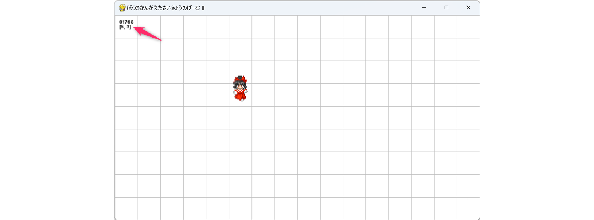

---
var:
  header-title: "オンラインテキストテンプレート 第99回 講義資料"
  header-date: "2024年04月23日（月）1・2時限"
---

# 第99回 2I-プログラミング1

## 概要・連絡

ここで $$a_{12} \times b_{21}^{5}$$ は32000000000000になります<i class="fa-solid fa-user-secret"></i>


### 連絡事項

- **Unity 1-Week GAME JAM** の紹介
  - [https://unityroom.com/unity1weeks](https://unityroom.com/unity1weeks)
  - **次回の開催** 12月18日(月) 0時 〜 12月24日(日) 20時 ... **お題「おくる」**
- 後期中間の「成績」は <span class="masked">後期開始の10月1日から後期中間試験までの期間</span> の評価になります (前期開始の4月から後期中間試験までの全体評価では「**ありません**」)。この期間に出題した課題は「課題07 (10点満点)」の１件、小テストは「小テスト❶ (10点満点)」と「小テスト❷ (10点満点)」の2件です。また、シラバスに記載しているように評価方法は <span class="masked">課題の提出状況とその内容（80%）ならびに授業中に実施する小テスト（20%）を総合して評価する</span> としています。従って、後期中間の成績は、課題07の評価を8倍して、小テスト❶と❷の点数を合計した100満点で評価しています。
  - 小テスト❶の「再テスト」を含めた評価の方法は[第18回講義の連絡事項](lecture18.html#連絡事項)を参照してください。

> 【成績評価の方法】<br>
> 1. 課題の提出状況とその内容（80%）ならびに授業中に実施する小テスト（20%）を総合して評価する。<br>
> 2. 100点法により評価し、60点以上を合格とする。

- 次回、12月25日 (月) の1-2時限は教員の都合により「**休講** (オンデマンド授業)」とさせてください。いつもと同じようにウェブテキストを用意しておくので、各自、教室や自宅で取り組みをお願いします。不明点などはLINEやメール、対面で対応します。
- 2024年3月までに **OMUメールのセットアップ**して、また、現行の gmail や GoogleDrive をバックアップする必要があります。詳しくは [GoogleClassroom](https://classroom.google.com/c/NjAyNDMyMzIwNzg2/m/NjQ1OTk3Nzc5NzAy/details) を参照してください。
  - PCからは [https://outlook.office365.com](https://outlook.office365.com) にアクセスするとウェブメールとして開くことができます (URLをブックマークしておいてください)。
  - モバイルアプリのインストールについては [GoogleClassroom](https://classroom.google.com/c/NjAyNDMyMzIwNzg2/m/NjQ1OTk3Nzc5NzAy/details) の添付資料を確認してください。

---

- 今回の講義では[前回に構築した開発環境](lecture22.html#演習のための環境構築動作確認)や[前処理した画像](lecture22.html#ゲーム開発の準備-画像データの前処理)を使用します。また、前回の内容について **ある程度は理解していること** を前提とします。また、前回に引き続き「**spellyon氏**」の「**点睛集積** ([http://dispell.net/](http://dispell.net/))」と、「**管理人nko氏**」の「**DOT ILLUST** ([https://dot-illust.net/](https://dot-illust.net/))」で配付されているフリー素材を使用します。必ず、下記を確認し、承諾のうえ利用してください。
  - 点睛集積の **利用規約** [http://dispell.net/rule_material.html](http://dispell.net/rule_material.html) 
  - DOT ILLUST の **利用規約** [https://dot-illust.net/terms/](https://dot-illust.net/terms/)

### 今回講義の達成目標

- **オブジェクト指向プログラミング**における基本的な用語（クラス、オブジェクト（インスタンス）、プロパティ、メソッド、コンストラクタなど）について理解し、具体的なイメージを持つことができる。
- **クラス**を定義するコードを記述できる。
- 既存のプログラムにクラスを導入して**構造化**することができる。

## キャラクタの表示 (PyGameを使った画像処理)

前回講義では **OpenCV** を利用して「ゲーム」に使用する画像を **切り出し** たり (=**トリミング**したり)、**拡大縮小**したりしました。同様に <span class="masked">PyGameライブラリを利用して画像の切り出しや拡大縮小、回転処理をすること</span> もできます。ここでは[前回講義](lecture22.html#前処理した画像の保存) のなかでダウンロードして、キャラ単位 (4方向x3アニメーションパターンの範囲) にトリミングした `data/img/reimu.png` を読込み、PyGame を使って「**1ポーズごと**」に切り出して、さらに「**縦横2倍**」に拡大して画面に配置する処理を行ないます。


具体的には、次のような画面 (霊夢の「**前向き**」「(ゼロオリジンで) **1番目**」のアニメーションポーズ) が表示されるようなプログラムを作成していきます。※ゼロオリジンとは、先頭要素を `0` 番目とするカウント方法です。


[前回に構築した開発環境](lecture22.html#演習のための環境構築動作確認)のなかで `05_game2_00-a.py` というファイルを新規作成して、以下のプログラムを貼り付けて実行し、その動作を確認してください (プログラムを読むと分かるように、現段階では**まだキャラクタを「操作すること」はできません**)。

```python{.numberLines caption="05_game2_00-a.py"}
import pygame as pg

def main():

  # 初期化処理
  chip_s = 48 # マップチップの基本サイズ
  map_s  = pg.Vector2(16,9) # マップの横・縦の配置数 

  pg.init() 
  pg.display.set_caption('ぼくのかんがえたさいきょうのげーむ II')
  disp_w = int(chip_s*map_s.x)
  disp_h = int(chip_s*map_s.y)
  screen = pg.display.set_mode((disp_w,disp_h))
  clock  = pg.time.Clock()
  font   = pg.font.Font(None,15)
  frame  = 0
  exit_flag = False
  exit_code = '000'

  # グリッド設定
  grid_c = '#bbbbbb'

  # 自キャラ移動関連【未実装】
  
  # 自キャラの画像読込み
  reimu_p = pg.Vector2(2,3)   # 自キャラ位置  
  reimu_s = pg.Vector2(48,64) # 画面に出力する自キャラサイズ 48x64
  reimu_d = 2 # 自キャラの向き
  reimu_img_raw = pg.image.load('./data/img/reimu.png')
  pose_p = pg.Vector2(24,64) # 前向き・2番目のポーズの位置　
  pose_s = pg.Vector2(24,32) # ポーズのサイズ
  tmp = reimu_img_raw.subsurface(pg.Rect(pose_p,pose_s))
  reimu_img = pg.transform.scale(tmp,reimu_s) 

  # ゲームループ
  while not exit_flag:

    # システムイベントの検出
    cmd_move = -1
    for event in pg.event.get():
      if event.type == pg.QUIT: # ウィンドウ[X]の押下
        exit_flag = True
        exit_code = '001'
      # 移動用のキー入力の検出【未実装】

    # 背景描画
    screen.fill(pg.Color('WHITE'))

    # グリッド
    for x in range(0, disp_w, chip_s): # 縦線
      pg.draw.line(screen,grid_c,(x,0),(x,disp_h))
    for y in range(0, disp_h, chip_s): # 横線
      pg.draw.line(screen,grid_c,(0,y),(disp_w,y))

    # 移動コマンドの処理【未実装】

    # 自キャラの描画 dp:描画基準点（imgの左上座標）
    dp = pg.Vector2(96,120)
    screen.blit(reimu_img,dp)

    # フレームカウンタの描画
    frame += 1
    frm_str = f'{frame:05}'
    screen.blit(font.render(frm_str,True,'BLACK'),(10,10))
    
    # 画面の更新と同期
    pg.display.update()
    clock.tick(30)

  # ゲームループ [ここまで]
  pg.quit()
  return exit_code

if __name__ == "__main__":
  code = main()
  print(f'プログラムを「コード{code}」で終了しました。')
```

このプログラムの**基本構造については前回の講義のなかで「解説済み」**です。新たな要素 (プログラム内に記載したコメントでいえば `#自キャラの画像読込み`、`#グリッド`、`#自キャラの描画` に関係する部分) について、以降、解説していきます。

### 画像の「切り出し」と「拡大」の処理

`data/img/reimu.png` は 256x288 の画像で **4方向x3アニメーションパターン** が収録されています。つまり、1個の「ポーズ」の画像の大きさは <span class="masked">24x32</span> となります。ここから「**前向き**」の「(ゼロオリジンで) **1番目**のアニメーションポーズ」を切り出して、さらに「2倍」に拡大する処理を **第25行目**から**第33行目** にかけて行なっています。

```python{.numberLines startFrom="25" caption="05_game2_00-a.py(抜粋)"}
# 自キャラの画像読込み
reimu_p = pg.Vector2(2,3)   # 自キャラ位置  
reimu_s = pg.Vector2(48,64) # 画面に出力する自キャラサイズ 48x64
reimu_d = 2 # 自キャラの向き
reimu_img_raw = pg.image.load('./data/img/reimu.png')
pose_p = pg.Vector2(24,64) # 前向き・2番目のポーズの位置　
pose_s = pg.Vector2(24,32) # ポーズのサイズ
tmp = reimu_img_raw.subsurface(pg.Rect(pose_p,pose_s))
reimu_img = pg.transform.scale(tmp,reimu_s) 
```

**第29行目** では、12個 (=3x4) のポーズが収録された画像を読み込んで、変数 `reimu_img_raw` に格納しています。つづく **第30行目** では、ポーズの**切り出しの開始位置** (左上位置のX,Y座標) を `pose_p` にセットし、**第31行目** では、ポーズの**切り出しの大きさ** (横幅,縦幅) を `pose_s` にセットしています。

**第32行目** では、`subsurface` メソッドで **矩形** (`rect`) を引数に与えて切り出しをして、その結果を変数 `tmp` に格納しています。具体的に言えば `reimu.png` の (X,Y)=(24,64) を左上として (W,H) = (24,32) の矩形領域を切り取った画像を、変数 `tmp` に格納しています。※[矩形](https://www.google.com/search?q=矩形)は <span class="masked">くけい</span> と読みます。


さらに、**第33行目** で `pg.transform.scale` によって「拡大処理」をしています。`scale` 関数の第1引数には「元画像」、第2引数には <span class="masked">拡大後の画像サイズ</span> を[Vector2 オブジェクト](lecture22.html#pygame-の-vector2-オブジェクト)や **タプル** で与えます。

**第30行目**から**第32行目**の処理については、次のように様々な書き方ができます。**いずれのスタイルで記述されていても読解できることが求められます**。文章の表現と同じで <span class="masked">唯一の正解の書き方/表現</span> というものは存在しません。

```python{.numberLines startFrom="30" caption="05_game2_00-a.py(抜粋)・オリジナル"}
pose_p = pg.Vector2(24,64) # 前向き・2番目のポーズの位置　
pose_s = pg.Vector2(24,32) # ポーズのサイズ
tmp = reimu_img_raw.subsurface(pg.Rect(pose_p,pose_s))
```

```python{.numberLines startFrom="30" caption="別の記述1"}
pose_p = pg.Vector2(24,64)
pose_s = pg.Vector2(24,32)
pose_rect = pg.Rect(pose_p,pose_s)
tmp = reimu_img_raw.subsurface(pose_rect)
```

```python{.numberLines startFrom="30" caption="別の記述2"}
pose_rect = pg.Rect(pg.Vector2(24,64),pg.Vector2(24,32))
tmp = reimu_img_raw.subsurface(pose_rect)
```

```python{.numberLines startFrom="30" caption="別の記述3"}
tmp = reimu_img_raw.subsurface(pg.Rect(pg.Vector2(24,64),pg.Vector2(24,32)))
```

```python{.numberLines startFrom="30" caption="別の記述4"}
tmp = reimu_img_raw.subsurface(pg.Rect((24,64),(24,32)))
```

```python{.numberLines startFrom="30" caption="別の記述5"}
pose_x = 24
pose_y = 64
pose_w = 24
pose_h = 32
tmp = reimu_img_raw.subsurface(pg.Rect((pose_x,pose_y),(pose_w,pose_h)))
```

```python{.numberLines startFrom="30" caption="別の記述6"}
pose_x, pose_y = 24, 64
pose_w, pose_w = 24, 32
tmp = reimu_img_raw.subsurface(pg.Rect((pose_x,pose_y),(pose_w,pose_w)))
```

---

また、**第33行目** の「**拡大処理**」には[前回講義の最後に示したサンプルコード](lecture22.html#ボールがバウンドするゲーム-改良版2)で使用した `pg.transform.rotozoom` を使用することもできます。ただし `pg.transform.scale` と `pg.transform.rotozoom` では出力に「差異」が生じます。詳しくは、<span class="masked">実際に実行結果 (画面出力の違い) を比較した</span> うえで、ウェブ検索などを利用して**内部処理の違い**を探ってみてください。

```python{.numberLines startFrom="33" caption="拡大処理に pg.transform.rotozoom を使用する方法"}
reimu_img = pg.transform.rotozoom(tmp,0,2) # 0度回転・2倍拡大
```

---

**演習1**: ゲーム画面に表示されるキャラクタが「前向き」「(ゼロオリジンで) **0番目**のアニメーションポーズ」になるようにせよ。また「(ゼロオリジンで) **2番目**のアニメーションポーズ」になるようにせよ。ヒント: **第30行目** の `pose_p`。 

**演習2**: ゲーム画面に表示されるキャラクタが「**左向き**」「(ゼロオリジンで) 1番目のアニメーションポーズ」になるようにせよ。また「**右向き**」になるようにせよ。

### グリッドの描画

以降の開発における動作確認 (デバッグ) を簡単にするために、画面に「**グリッド (マス目)**」を表示しています。グリッドの描画は、主に **第49行目**から**第53行目** で行なっています。

```python{.numberLines startFrom="06" caption="05_game2_00-a.py(抜粋)"}
# 初期化処理
chip_s = 48 # マップチップの基本サイズ
```

```python{.numberLines startFrom="20" caption="05_game2_00-a.py(抜粋)"}
# グリッド設定
grid_c = '#bbbbbb'
```

```python{.numberLines startFrom="53" caption="05_game2_00-a.py(抜粋)"}
# グリッド
for x in range(0, disp_w, chip_s): # 縦線
  pg.draw.line(screen,grid_c,(x,0),(x,disp_h))
for y in range(0, disp_h, chip_s): # 横線
  pg.draw.line(screen,grid_c,(0,y),(disp_w,y))
```

**第55行目** と **第57行目** の `pg.draw.line` 関数の第1引数には「**描画先**」、第2引数には「**線色**」、第3引数には <span class="masked">線分の始点座標のVector2やタプル/リスト</span>、第4引数には <span class="masked">線分の終点座標のVector2やタプル/リスト</span> を与えます。

**線幅** の設定については[公式リファレンス](https://www.pygame.org/docs/ref/draw.html#pygame.draw.line)を参照してください。また、<span class="masked">アンチエイリアシングした線分</span class="masked"> を描画する `pg.draw.lin.aaline` 関数も存在します。


---

**演習**: グリッドの「色」と「**線幅**」を変更せよ。

### キャラクタの描画

キャラクタ画像の画面描画は **第57行目**から**第59行目** で行っています。


**第59行目** の `screen.blit` 関数の第1引数には「表示する画像」、第2引数には「**画像の左上を配置するスクリーン座標**」を与えます。具体的には、ここでは スクリーン上 (画面上) の (X,Y) = (96,120) の位置に、48x64 のキャラクタ画像の <span class="masked">左上</span> をあわせて配置するようなプログラムになっています。キャラクタを <span class="masked">グリッドの中央にあわせる</span> ための調整 を含めて `(96,120)` という値にしています ( なぜこのような値にしているか? を考えてみてください )。

```python{.numberLines startFrom="57" caption="05_game2_00-a.py(抜粋)"}
# 自キャラの描画 dp:描画基準点（imgの左上座標）
dp = pg.Vector2(96,120)
screen.blit(reimu_img,dp)
```

---

**演習1**: キャラクタが(ゼロオリジンの) **グリッド座標 (5,3)** に表示されるように変更せよ。ただし、**第26行目** を `reimu_p = pg.Vector2(5,3)` に変更し、それを参照する計算によってキャラクタの描画位置 `dp` を設定すること (つまり `reimu_p` の値に対応してキャラクタの表示位置が変化するようにせよ)。解答例:<span class="masked">次のセクションに示す `05_game2_00-b.py` の第79行目を参照</span>

**演習2**: 次のようにフレームカウンタの下にキャラクタを配置している「グリッド座標」が表示されるようにせよ。



## キーの入力による移動機能の追加

`05_game2_00-b.py` というファイルを新規作成して、以下のプログラムを貼り付けて実行し、動作を確認してください。このプログラムは、変数 `reimu_p` の値を参照して **キャラクタの表示位置が変化するようにしたプログラム** (=先の演習の解答例) に <span class="masked">カーソルキーによる移動機能</span> を追加実装したものになります。現状では **1マス単位の離散的な移動** かつ **FC版ドラクエ1のように「カニ歩き」**しかできません。

追加実装された部分は **第23行目**から**第30行目** の `#自キャラ移動関連のパラメータ設定`、**第51行目**から**第60行目** の `#移動操作の「キー入力」の受け取り処理`、**第71行目**から**第76行目**の `#移動コマンドの処理` になります。

```python{.numberLines caption="05_game2_00-b.py"}
import pygame as pg

def main():

  # 初期化処理
  chip_s = 48 # マップチップの基本サイズ
  map_s  = pg.Vector2(16,9) # マップの横・縦の配置数 

  pg.init() 
  pg.display.set_caption('ぼくのかんがえたさいきょうのげーむ II')
  disp_w = int(chip_s*map_s.x)
  disp_h = int(chip_s*map_s.y)
  screen = pg.display.set_mode((disp_w,disp_h))
  clock  = pg.time.Clock()
  font   = pg.font.Font(None,15)
  frame  = 0
  exit_flag = False
  exit_code = '000'

  # グリッド設定
  grid_c = '#bbbbbb'

  # 自キャラ移動関連のパラメータ設定
  cmd_move = -1 # 移動コマンドの管理変数
  m_vec = [
    pg.Vector2(0,-1),
    pg.Vector2(1,0),
    pg.Vector2(0,1),
    pg.Vector2(-1,0)
  ] # 移動コマンドに対応したXYの移動量
  
  # 自キャラの画像読込み
  reimu_p = pg.Vector2(2,3)   # 自キャラ位置  
  reimu_s = pg.Vector2(48,64) # 画面に出力する自キャラサイズ 48x64
  reimu_d = 2 # 自キャラの向き
  reimu_img_raw = pg.image.load('./data/img/reimu.png')
  pose_p = pg.Vector2(24,64) # 前向き・2番目のポーズの位置　
  pose_s = pg.Vector2(24,32) # ポーズのサイズ
  tmp = reimu_img_raw.subsurface(pg.Rect(pose_p,pose_s))
  reimu_img = pg.transform.scale(tmp,reimu_s) 

  # ゲームループ
  while not exit_flag:

    # システムイベントの検出
    cmd_move = -1
    for event in pg.event.get():
      if event.type == pg.QUIT: # ウィンドウ[X]の押下
        exit_flag = True
        exit_code = '001'
      # 移動操作の「キー入力」の受け取り処理
      if event.type == pg.KEYDOWN:
        if event.key == pg.K_UP:
          cmd_move = 0
        elif event.key == pg.K_RIGHT:
          cmd_move = 1
        elif event.key == pg.K_DOWN:
          cmd_move = 2
        elif event.key == pg.K_LEFT:
          cmd_move = 3

    # 背景描画
    screen.fill(pg.Color('WHITE'))

    # グリッド
    for x in range(0, disp_w, chip_s): # 縦線
      pg.draw.line(screen,grid_c,(x,0),(x,disp_h))
    for y in range(0, disp_h, chip_s): # 横線
      pg.draw.line(screen,grid_c,(0,y),(disp_w,y))

    # 移動コマンドの処理
    if cmd_move != -1:
      reimu_d = cmd_move # 現時点では使わない変数 (あとで使用)
      af_pos = reimu_p + m_vec[cmd_move] # 移動後の (仮) 座標
      if (0 <= af_pos.x <= map_s.x-1) and (0 <= af_pos.y <= map_s.y-1) :
        reimu_p += m_vec[cmd_move] # 画面内に収まるならキャラ座標を実際に更新

    # 自キャラの描画 dp:描画基準点（imgの左上座標）
    dp = reimu_p*chip_s - pg.Vector2(0,24)
    screen.blit(reimu_img,dp)

    # フレームカウンタの描画
    frame += 1
    frm_str = f'{frame:05}'
    screen.blit(font.render(frm_str,True,'BLACK'),(10,10))
    screen.blit(font.render(f'{reimu_p}',True,'BLACK'),(10,20))
    
    # 画面の更新と同期
    pg.display.update()
    clock.tick(30)

  # ゲームループ [ここまで]
  pg.quit()
  return exit_code

if __name__ == "__main__":
  code = main()
  print(f'プログラムを「コード{code}」で終了しました。')
```

**演習**: カーソルキーを押下し続けた場合、どのように処理されるのか (キャラクタが1回だけ (1マスだけ) 移動するのか、連続的に移動するのか) を確認せよ。

以下、「**追加実装した部分のみ**」を解説をしていきます。

### キャラクタ移動関連のパラメータ設定

**第23行目**から**第30行目**に追加したコードについて解説します。

```python{.numberLines startFrom="23" caption="05_game2_00-b.py(抜粋)"}
  # 自キャラ移動関連のパラメータ設定
  cmd_move = -1 # 移動コマンドの管理変数
  m_vec = [
    pg.Vector2(0,-1),
    pg.Vector2(1,0),
    pg.Vector2(0,1),
    pg.Vector2(-1,0)
  ] # 移動コマンドに対応したXYの移動量
```

**第24行目** では、ユーザーからのキーボードを使った「移動操作入力」の **有無** と **内容** (以降「**移動コマンド**」と称します) を整数値 (`-1`から`3`) で保持・管理する変数 `cmd_move` を定義し、その初期値を `-1` としています。

移動コマンドの **内容** と **値 (整数値)** の対応関係は、次のように定めます。

- `-1` : **移動入力なし**
- `0` : 上方向 (**Yが減少**する方向) への移動入力あり
- `1` : 右方向 (Xが増加する方向) への移動入力あり
- `2` : 下方向 (**Yが増加**する方向) への移動入力あり
- `3` : 左方向 (Xが減少する方向) への移動入力あり

**第25行目** から **第30行目** では、移動コマンドに対応したXYの移動量を **Vector2オブジェクトのリスト** として定義しています。例えば、**移動コマンド** `cmd_move` が `1` (=右方向への移動入力) のとき、` m_vec[cmd_move]` は <span class="masked">`pg.Vector2(1,0)`</span> を返します。なお、Pythonのリストの特性上、`cmd_move` が `-1` のとき ` m_vec[cmd_move]` とすると <span class="masked">`pg.Vector2(-1,0)`</span> が返ってくるので注意してください ([第08回講義](lecture08.html#リストのインデックス範囲)を参照)。

ここで、移動コマンドの 整数値 `0,1,2,3` を `上,右,下,左` に対応させているのは、`data/img/reimu.png` (=RPGツクール2000 の移動キャラのフォーマット) の画像ならびが、上から順に `上,右,下,左` となっているためです。このようにしておくことで、あとでキャラクタの <span class="masked">「向き」にあわせた画像を2次元リストから参照</span> する際、シンプルにコードが記述できるようになります。


### 移動操作の「キー入力」の受け取り処理

**第51行目**から**第60行目**では、ゲームループのなかで**ユーザーからの移動操作の**「**キーボード入力**」を受け取り、それ**整数値** ( `-1`から`3` ) に変換して `cmd_move` に格納しています。

```python{.numberLines startFrom="45" caption="05_game2_00-b.py(抜粋)"}
# システムイベントの検出
cmd_move = -1
for event in pg.event.get():
  if event.type == pg.QUIT: # ウィンドウ[X]の押下
    exit_flag = True
    exit_code = '001'
  # 移動操作の「キー入力」の受け取り処理
  if event.type == pg.KEYDOWN:
    if event.key == pg.K_UP:
      cmd_move = 0
    elif event.key == pg.K_RIGHT:
      cmd_move = 1
    elif event.key == pg.K_DOWN:
      cmd_move = 2
    elif event.key == pg.K_LEFT:
      cmd_move = 3
```

まず **第46行目** で、ゲームループごとに `cmd_move` を `-1` (=移動入力なし) に初期化しています。つづいて **第52行目**から**第60行目** で、カーソルキーの押下 (Key Down) を検出して `cmd_move` を更新しています。キー入力の検出については、既に[前回講義](lecture22.html#動作確認1-pygame)で学んでいます。

なお、**キーの押下を続けているとき**、連続的に `cmd_move` を更新する方法については次回講義で扱います。現状では、キーの押下を続けていても、押下した瞬間のゲームループのときしか `cmd_move` の値は更新されません。

### 移動コマンドの処理

**第71行目**から**第76行目**では、移動コマンド `cmd_move` に `-1` (=移動なし) 以外の値が入っているときに `reimu_p` (=キャラクタのグリッド座標位置) を更新する処理をしています。ただし、**第75行目** の「if文」を使って <span class="masked">キャラクタが画面外には移動しない</span> ように工夫をしています。

```python{.numberLines startFrom="71" caption="05_game2_00-b.py(抜粋)"}
# 移動コマンドの処理
if cmd_move != -1:
  reimu_d = cmd_move # 現時点では使わない変数 (あとで使用)
  af_pos = reimu_p + m_vec[cmd_move] # 移動後の (仮) 座標
  if (0 <= af_pos.x <= map_s.x-1) and (0 <= af_pos.y <= map_s.y-1) :
    reimu_p += m_vec[cmd_move] # 画面内に収まるならキャラ座標を実際に更新
```

**第73行目** の `reimu_d` は、(**現時点では未使用ですが**) キャラクタの「**向き** (Direction)」を保持・管理するための変数です。移動方向と同じで、次のように「値 (整数値)」と「キャラクタの向き」を対応させる予定です。

- `0` : 上向き (後向き) の画像を表示させる
- `1` : 右向き の画像を表示させる
- `2` : 下向き (前向き) の画像を表示させる
- `3` : 左向き の画像を表示させる

## キャラクタの「向き」と「アニメーション」の追加

`05_game2_01.py` というファイルを新規作成して、以下のプログラムを貼り付けて実行し、動作を確認してください。このプログラムは、変数 `reimu_d` の値に対応して <span class="masked">キャラクタの「向き」に応じた画像が表示される</span> ようにして、さらにキャラクタが「**足踏みのアニメーション**」をするように改良したものになります。

ついに **100行を超えるプログラム** になってきましたが、先のセクション の `05_game2_00-b.py` からの変更されている部分は **第36行目**から**第45行目**、**第83行目**から**第86行目** だけになります。恐れる必要はありません。

```python{.numberLines caption="05_game2_01.py"}
import pygame as pg

def main():

  # 初期化処理
  chip_s = 48 # マップチップの基本サイズ
  map_s  = pg.Vector2(16,9) # マップの横・縦の配置数 

  pg.init() 
  pg.display.set_caption('ぼくのかんがえたさいきょうのげーむ II')
  disp_w = int(chip_s*map_s.x)
  disp_h = int(chip_s*map_s.y)
  screen = pg.display.set_mode((disp_w,disp_h))
  clock  = pg.time.Clock()
  font   = pg.font.Font(None,15)
  frame  = 0
  exit_flag = False
  exit_code = '000'

  # グリッド設定
  grid_c = '#bbbbbb'

  # 自キャラ移動関連
  cmd_move = -1 # 移動コマンドの管理変数
  m_vec = [
    pg.Vector2(0,-1),
    pg.Vector2(1,0),
    pg.Vector2(0,1),
    pg.Vector2(-1,0)
  ] # 移動コマンドに対応したXYの移動量
  
  # 自キャラの画像読込み
  reimu_p = pg.Vector2(2,3)   # 自キャラ位置  
  reimu_s = pg.Vector2(48,64) # 画面に出力する自キャラサイズ 48x64
  reimu_d = 2 # 自キャラの向き
  reimu_img_raw = pg.image.load('./data/img/reimu.png')
  reimu_img_arr = []
  for i in range(4):   # 上右下左の4方向
    reimu_img_arr.append([])
    for j in range(3): # アニメーションパターンx3
      p = pg.Vector2(24*j,32*i) # 切り抜きの開始座標・左上
      tmp=reimu_img_raw.subsurface(pg.Rect(p,(24,32))) # 切り出し
      tmp = pg.transform.scale(tmp,reimu_s) # 拡大
      reimu_img_arr[i].append(tmp)
    reimu_img_arr[i].append(reimu_img_arr[i][1])

  # ゲームループ
  while not exit_flag:

    # システムイベントの検出
    cmd_move = -1
    for event in pg.event.get():
      if event.type == pg.QUIT: # ウィンドウ[X]の押下
        exit_flag = True
        exit_code = '001'
      # 移動操作の「キー入力」の受け取り処理
      if event.type == pg.KEYDOWN:
        if event.key == pg.K_UP:
          cmd_move = 0
        elif event.key == pg.K_RIGHT:
          cmd_move = 1
        elif event.key == pg.K_DOWN:
          cmd_move = 2
        elif event.key == pg.K_LEFT:
          cmd_move = 3

    # 背景描画
    screen.fill(pg.Color('WHITE'))

    # グリッド
    for x in range(0, disp_w, chip_s): # 縦線
      pg.draw.line(screen,grid_c,(x,0),(x,disp_h))
    for y in range(0, disp_h, chip_s): # 横線
      pg.draw.line(screen,grid_c,(0,y),(disp_w,y))

    # 移動コマンドの処理
    if cmd_move != -1:
      reimu_d = cmd_move # キャラクタの向きを更新
      af_pos = reimu_p + m_vec[cmd_move] # 移動後の (仮) 座標
      if (0 <= af_pos.x <= map_s.x-1) and (0 <= af_pos.y <= map_s.y-1) :
        reimu_p += m_vec[cmd_move] # 画面外に移動しないなら実際のキャラを移動

    # 自キャラの描画 dp:描画基準点（imgの左上座標）
    dp = reimu_p*chip_s - pg.Vector2(0,24)
    af = frame//6%4 # 6フレーム毎にアニメーション
    screen.blit(reimu_img_arr[reimu_d][af],dp)

    # フレームカウンタの描画
    frame += 1
    frm_str = f'{frame:05}'
    screen.blit(font.render(frm_str,True,'BLACK'),(10,10))
    screen.blit(font.render(f'{reimu_p}',True,'BLACK'),(10,20))
    
    # 画面の更新と同期
    pg.display.update()
    clock.tick(30)

  # ゲームループ [ここまで]
  pg.quit()
  return exit_code

if __name__ == "__main__":
  code = main()
  print(f'プログラムを「コード{code}」で終了しました。')
```

以下、変更された部分について解説をしていきます。

### キャラクタの全12ポーズの読込み

**第36行目**から**第45行目**では、キャラクタについての「上右下左の4方向・各3ポーズ (=全12ポーズ)」を読込み、**少しだけ拡張したうえで**、それを2次元リスト `reimu_img_arr` に格納しています。それにより、例えば「**右向き**・**0番目**のポーズ」の画像を `reimu_img_arr[1][0]` で取得 (参照) できるように、「**右向き**」「**1番目**のポーズ」の画像を `reimu_img_arr[1][1]` で取得 (参照) できるようにしています。

つまり `reimu_img_arr[i][j]` とすれば、`i` で<span class="masked">キャラクタの向き</span> を指定し、`j` で<span class="masked">アニメーションポーズ</span> を指定して、画像 (キャラクタのポーズ) を取得 (参照) できるような**データ構造**にしています。


**演習1**: 「**前向き**・**1番目**のポーズ」は、`reimu_img_arr` に対してどのようにインデックス (つまり `reimu_img_arr[i][j]` の `i` と `j` の具体的な値) を与えればアクセスできるか答えよ。**解答**: <span class="masked">`reimu_img_arr[2][1]`</span>

**演習2**: 「**左向き**・**2番目**のポーズ」は、`reimu_img_arr` に対してどのようにインデックスを与えればアクセスできるか答えよ。**解答**: <span class="masked">`reimu_img_arr[3][2]`</span>

---

`./data/img/reimu.png` に収録されているアニメーション用のポーズは、各方向とも「**3パターン**」です。具体的には、**0列目**が「右足が前のポーズ」、**1列目**が「両足が揃ったポーズ」、**2列目**が「左足が揃ったポーズ」が収録されています。

これらを使って**自然な歩行のアニメーション**をつくるためには「右足が前のポーズ」→「両足が揃ったポーズ」→「左足が前のポーズ」→「<span class="masked">(再び) 両足が揃ったポーズ</span>」→ ... を繰り返す必要があります。`reimu_img_arr[i][j]` のインデックスでいえば `j` を `0` → `1` → `2` → `1` → `0` → `1` → `2` → `1` → ... のように切り替えていく必要があります。

しかし、今回はコードをできるだけシンプルに保つために <span class="masked">2次元リストの「列」を1個拡張して、1番目のポーズと同じ画像を「3番目」にも配置</span> して、`reimu_img_arr[i][j]` の `j` を `0` → `1` → `2` → `3` → `0` → `1` → `2` → `3` ... のように切り替えることでアニメーションするようにしました。

そのような前提で、`reimu_img_arr` を以下のように <span class="masked">4</span>**行**<span class="masked">3</span>**列** の「2次元リスト」に初期化しています。なお、リストに**要素を追加**する `append` メソッドの詳細は[第08回講義](lecture08.html#リストにおける要素の書き換えと追加)を参照してください。

```python{.numberLines startFrom="36" caption="05_game2_01.py(抜粋)"}
reimu_img_raw = pg.image.load('./data/img/reimu.png')
reimu_img_arr = []
for i in range(4):   # 上右下左の4方向
  reimu_img_arr.append([])
  for j in range(3): # アニメーションパターンx3
    p = pg.Vector2(24*j,32*i) # 切り抜きの開始座標・左上
    tmp=reimu_img_raw.subsurface(pg.Rect(p,(24,32))) # 切り出し
    tmp = pg.transform.scale(tmp,reimu_s) # 拡大
    reimu_img_arr[i].append(tmp)
  reimu_img_arr[i].append(reimu_img_arr[i][1])
```

上記のプログラムについて、自力で解読が難しい場合は ChatGPT などを活用してください。

- [ChatGPTの活用例](https://chat.openai.com/share/9603f997-79e6-4e69-b776-4491b04dcd58)


なお、**第45行目**の処理 (第1列目の内容を第3列目に複製) は[浅いコピー(Shallow Copy)](lecture13.html#リストの浅いコピーと深いコピー)に相当する処理であるため、<span class="masked">メモリ使用量をほとんど圧迫</span> しません。

---

**演習**: **第46行目**に、次のコードを追加して **AssertionError** が「発生しないこと」を確認せよ。`for i in range(4):` **ブロックの外側** (ブロックを抜けたところ) に記述するようにインデントに注意せよ。

```python{.numberLines caption="reimu_img_arr の確認処理"}
assert len(reimu_img_arr) == 4
assert reimu_img_arr[0][1] == reimu_img_arr[0][3]
assert reimu_img_arr[1][1] == reimu_img_arr[1][3]
assert reimu_img_arr[2][1] == reimu_img_arr[2][3]
assert reimu_img_arr[3][1] == reimu_img_arr[3][3]
```

上記の assert では、`reimu_img_arr` の各行の**「1列目」と「3列目」に同じ画像** (=前足が揃っているポーズ) が格納されていることを確認しています。

### キャラクタの「向き」と「アニメーション」の切り替え処理

**第77行目**と**第78行目**では、ユーザーからの移動操作の「キー入力」があったときに、キャラの向きを保持・管理する変数 `reimu_d` を更新しています。例えば、カーソルキーの「**右** (`pg.K_RIGHT`)」が押下されたとき、`cmd_move` は `1` となるので、**第78行目** により @`reimu_d` も `1` になります。

この変数 `reimu_d` は **第86行目** で `reimu_img_arr[reimu_d][af]` のように参照され、これにより **画面に表示されるキャラクタの「向き」が変更される仕組み** になっています。

```python{.numberLines startFrom="77" caption="05_game2_01.py(抜粋)"}
if cmd_move != -1:
  reimu_d = cmd_move # キャラクタの向きを更新
```

```python{.numberLines startFrom="83" caption="05_game2_01.py(抜粋)"}
# 自キャラの描画 dp:描画基準点（imgの左上座標）
dp = reimu_p*chip_s - pg.Vector2(0,24)
af = frame//6%4 # 6フレーム毎にアニメーション
screen.blit(reimu_img_arr[reimu_d][af],dp)
```

キャラクタのアニメーションは、**第85行目** と **第86行目** の処理で実現されています。このコードでは **6フレーム毎 (=現在は 30fps で動かしているので 6/30 = 1/5 秒毎)** にキャラのポーズが切り替わってアニメーションするようにしています。このアニメーション制御は、変数 `af` が鍵となっています。

**第85行目** の `af = frame//6%4` が分かりずらいと思うので順序立てて説明していきます。適当な Jupyter ノートブックを作成して、そこでコードを試しながら1段階ずつ理解を進めてください。

まず、変数 `frame` は、`05_game2_01.py` の **第89行目**で `frame += 1` となっているように <span class="masked">ゲームループ毎にカウントアップ</span> する変数でした。また、ゲームループは **第96行目** の `clock.tick(30)` によって基本的には **1/30秒** で繰り返されます。つまり `frame` は 1/30 秒ごとに **カウントアップ** していきます。

ここで、疑似的に `frame` が「1205」から「1224」の範囲のゲームループをつくり、そこで `af = frame` として、`af` の値を出力するプログラムを考えます。ここで `af` は Animation Frame の略です。

```python{.numberLines caption="変数afの値の確認1"}
%reset -f
frame = 1205
for _ in range(20):
  af = frame
  print(f'frame = {frame}   af = {af}')
  frame += 1
```

実行結果は次のようになります。

```
frame = 1205   af = 1205
frame = 1206   af = 1206
frame = 1207   af = 1207
frame = 1208   af = 1208
frame = 1209   af = 1209
frame = 1210   af = 1210
frame = 1211   af = 1211
frame = 1212   af = 1212
frame = 1213   af = 1213
frame = 1214   af = 1214
frame = 1215   af = 1215
frame = 1216   af = 1216
frame = 1217   af = 1217
frame = 1218   af = 1218
frame = 1219   af = 1219
frame = 1220   af = 1220
frame = 1221   af = 1221
frame = 1222   af = 1222
frame = 1223   af = 1223
frame = 1224   af = 1224
```

当然ながら、この `af` を使って `reimu_img_arr[reimu_d][af]` のようにすれば、インデックスの範囲 (`0`～`3`) を突破して **IndexError** が発生します。

---

そこで、**IndexError** が生じないように **第04行目** を `af = frame` から `af = frame % 4` に書き換えます。`%` 演算子は、割り算の <span class="masked">余り (剰余)</span> を求める演算子でした。

```python{.numberLines caption="変数afの値の確認2"}
%reset -f
frame = 1205
for _ in range(20):
  af = frame % 4  # ここを変更した
  print(f'frame = {frame}   af = {af}')
  frame += 1
```

実行結果は次のようになります。例えば 1205 を 4 で割ると、商が「301」で余りが「1」となるので `af` は `1` となります。

```
frame = 1205   af = 1
frame = 1206   af = 2
frame = 1207   af = 3
frame = 1208   af = 0
frame = 1209   af = 1
frame = 1210   af = 2
frame = 1211   af = 3
frame = 1212   af = 0
frame = 1213   af = 1
frame = 1214   af = 2
frame = 1215   af = 3
frame = 1216   af = 0
frame = 1217   af = 1
frame = 1218   af = 2
frame = 1219   af = 3
frame = 1220   af = 0
frame = 1221   af = 1
frame = 1222   af = 2
frame = 1223   af = 3
frame = 1224   af = 0
```

これで `reimu_img_arr[reimu_d][af]` において **IndexError** は発生しません。実際に `05_game2_01.py` の **第85行目** を `af = frame % 4` に書き換えてみてください。確かに、エラーは発生しませんが、一方で <span class="masked">アニメーションが高速すぎる</span> という問題があります。

---

そこで、`af = frame % 4` を `af = frame // 6 % 4` に書き換えます。`//` 演算子は、割り算の「商 (整数値)」を求める演算子でした。例えば、`10//3` は `3` となります。`frame // 6 % 4` は、`frame` を 6 で割った「商」を計算し、それをさらに 4 で割った「余り」を求める計算式になります。

```python{.numberLines caption="変数afの値の確認3"}
%reset -f
frame = 1205
for _ in range(20):
  af = frame // 6 % 4  # ここを変更した
  print(f'frame = {frame}   af = {af}')
  frame += 1
```

実行結果は次のようになります。`af` の値は6フレームの期間、同じ値をとることが分かります。30fps おいて、1フレームは 1/30 秒、6フレームは 1/5 秒 になります。よって、1/5 秒毎にポーズが切り替わるように調整されたアニメーションとすることができます。

```
frame = 1205   af = 0
frame = 1206   af = 1
frame = 1207   af = 1
frame = 1208   af = 1
frame = 1209   af = 1
frame = 1210   af = 1
frame = 1211   af = 1
frame = 1212   af = 2
frame = 1213   af = 2
frame = 1214   af = 2
frame = 1215   af = 2
frame = 1216   af = 2
frame = 1217   af = 2
frame = 1218   af = 3
frame = 1219   af = 3
frame = 1220   af = 3
frame = 1221   af = 3
frame = 1222   af = 3
frame = 1223   af = 3
frame = 1224   af = 0
```

<br>

**演習1**: `05_game2_01.py` の **第85行目** を `af = frame // 6 % 3` とすると (「右足が前のポーズ `0`」→「両足が揃ったポーズ `1`」→「左足が揃ったポーズ `2`」→「**右足が前のポーズ** `0`」→ 「両足が揃ったポーズ `1`」→「左足が揃ったポーズ `2`」→ ... の繰り返しパターンにすると) ぎこちないアニメーションになることを確認せよ。

**演習2**: `05_game2_01.py` では「**48px**」を基準にゲーム画面が構成、描画されている。これを「24px」あるいは「72px」を基準にゲームが画面が構成、描画されるように変更せよ (つまり、**ゲーム画面の表示倍率変更** をせよ)。例えば `scale_factor` という定数を設け、それが `1` のときは「24px」を基準に、また `2` のときは「48px」を基準に、また `3` のときは「72px」を基準にゲームが画面が構成、描画されるように変更せよ。実装例は[こちら](https://github.com/TakeshiWada1980/Programming1-2023/blob/main/docs/code/23/05_game2_01-a.py)。

### 次のセクションを読み進める前に...

次のセクションは `05_game2_1.py` の「**構造**」や「**流れ**」を理解していることが前提となります。つまり <span class="masked">各変数や各定数に格納される値の役割と、それらの依存関係、それに基づき決定される処理の順序関係</span>について、(プログラムコードを参照しなくとも) 頭のなかで大まかに整理・理解し、**他者に説明できるレベル** になっていることが前提となります。

例えば、以下の「問い」に答えることができれば、次のセクションを読み進めることに問題はありません。

- **問い**: キャラクタを任意のグリッド座標 (例えば (9,8) など) に配置するための **具体的なスクリーン座標** (=プログラムでは `dp` と表現していたもの) を計算したい。この計算に必要な変数や定数は、何の情報を保持している何型の値 (float? int? Vector2? list? tuple?) で、どの段階で初期化や更新がされるものか答えよ。
- **問い**: 現在、キャラクタは画面外には移動できないようになっている。移動可否を判定するために参照する変数・定数は、何の情報を保持している何型の値で、どの段階で初期化や更新がされるものか答えよ。具体的に、どのような判定式を用いているか答えよ。
- **問い**: ユーザーからキーボード入力があると「移動コマンド」を管理する変数 `cmd_move` の値が更新される。この `cmd_move` の更新によって影響を受ける可能性がある全ての変数を答えよ。

上記の「問い」は、変数や定数の名前を正確に答えることを意図しているわけでありません、変数同士の <span class="masked">依存関係</span>について整理できているか、また依存関係に基づく <span class="masked">処理順序</span> が整理できているかについて確認するものです。

これらが不十分なまま、次のセクションを読み進めても余計に混乱するだけなので、無理せずに、再度、`05_game2_01.py` の理解に努めてください。

## オブジェクト指向プログラミング (超々入門)

**_オブジェクト指向プログラミング_**（**OOP** : **Object Oriented Programming**）とは <span class="masked">ソフトウェアの設計と実装に関する概念</span> のひとつであり、また、それを具現化するために**プログラミング言語が提供する各種機能や構文を使用した実装**を指します。

- ウェブ検索:[オブジェクト指向プログラミングとは](https://www.google.com/search?q=オブジェクト指向プログラミングとは)
- ChatGPT:[オブジェクト指向プログラミングについて教えてください](https://chat.openai.com/share/87aa1eeb-aa5a-4d6c-9fea-8f749fd91ea9)

OOPは **極めて「抽象度」が高い概念** であり、また、それがカバーする範囲も広く奥深いものとなっています。それゆえ、OOPの「定義」さえ <span class="masked">いまだに論争が尽きない</span> ほどです（実際に、丸々1冊が「OOPとは何か」について書かれている[書籍](https://www.amazon.co.jp/dp/B092HDFJKK/)も多数あります）。

本講義では、これまでも「**ソフトウェアの設計と実装に関する概念**」として[関数](lecture11.html#関数-fuction-初級)や[リスト (配列)](ecture08.html#pythonにおけるリストとは)、[繰り返し構文](lecture07.html#繰り返し構文におけるループ変数の参照)などを学んできましたが、OOPでは単純に **関連用語の数だけ** をみても、それらとは比較にならないほど多いです。例えば、基本的な用語だけでも「クラス」「オブジェクト (インスタンス)」「コンストラクタ」「メソッド」「プロパティ」「カプセル化」「継承」「多態性 (ポリモーフィズム)」などがあります。そして、それら1語1語に対応した概念・機能があり、OOPの学習では、それについても理解していくことが求められます。

<div class="note type-tips">
**オブジェクト指向プログラミングを習得するには、どれぐらいの時間がかかるのか**

(無論、個人差は大きいですが) 朝から晩まで、プログラミングだけを学べる環境にはない学生では、半年から1年、場合によっては2年ぐらいの時間をかけて「実装」と「理論」の両輪をまわすことを通じて **OOPについて腑に落ちる** という状態に到達すると思います。実際、Hカリの電子情報コースでは4年生に「オブジェクト指向プログラミング」という授業が「半期」で設定されています。
</div>

以上のように説明され**だいぶ身構えてしまったかと思いますが**、既に皆さんは オブジェクト指向プログラミングの一端に触れ、それを利用した実装にも多数取り組んできてもらっています。どういうことか言うと、**大多数の Pythonライブラリ（モジュール）は OOP で設計・実装されており**、それを利用するという形で、皆さんは、既に OOP を何度となく体験しています。

たとえば、[前回講義](lecture22.html#pygame-の-vector2-オブジェクト) から登場している **PyGameライブラリ** の `Vector2` は OOP における <span class="masked">クラス</span> という存在であり、`p = Vector2(2,3)` のように初期化（=クラスから生成した）`p` は、OOP における「**オブジェクト（インスタンス）**」という存在になります。同様に、`p` の持つX成分にアクセスする `p.x` は <span class="masked">プロパティ</span>、ベクトルの長さ (大きさ) を計算した戻り値を得る `p.length()` は <span class="masked">メソッド</span> と呼ばれるものになります。

同様に、<span class="masked">NumPy の「ndarray」も、Pandas の「DataFrame」</span>も「**クラス**」であり、皆さんは、これまでにそれらを使用してきています。

このように、誰かが設計したクラスを <span class="masked">シンプルに利用する</span> という観点で言えば **OOP は決して難しいというものではなく**、むしろ、**煩雑なコーディングを減らして生産性を高めてくれる存在** となります。例えば `Vector2` を使わずに `[2,3]` のようなリストだけで `05_game2_01.py` を実装することを想像してみてください。可読性は大幅に低下しますし、各種計算も非常に面倒になっていたはずです。

ここからは、「他者が設計した既存のクラスを利用する」のではなく「**自分自身でクラスを設計する**」というステージの OOP の学習もしていきます。

### 準備: プログラムの構造化

プログラムにおける「**構造化**」とは、**プログラムの可読性、保守性、拡張性、再利用性を「高い水準で維持する」ために**「プログラムの構造」を検討・設計・実装することを指します。これまでに学んだ範囲で言えば、次のようなことが **広義の構造化** になります。

- 変数には意味のある名前をつける。
- 数値や文字列は、使用前に変数に格納する。
- 関連する処理はコード上で近くにまとめて記述する。
- 同じ種類のデータを大量に扱うときは、リストや辞書などのデータ構造を使用する。
- 同じような処理を連続的に実行するときは、ループなどの制御構造を使用する。
- 重複するコードは関数としてまとめる。
- 機能や目的、理由を説明する適切なコメントを記述する。
- 適切な単位で複数のファイルにプログラムを分割する。

この観点で言えば `05_game2_01.py` は、ある程度の構造化が実現されており、その結果として <span class="masked">比較的容易に「拡張」や「修正」に取り組むこと</span> ができます。実際、先に取り組んだ **演習2**「ゲーム画面の表示倍率変更」は、わずかなコード修正で対応ができました。

一方で、構造化されていないプログラムは、その「拡張」や「修正」が **絶望的に困難** となります。例えば、以下の `05_game2_01-ng.py` は、**(あえて) 構造化せずにコーディングしたもの** です。

このプログラムは、元々の `05_game2_01.py` と **完全に同じ動作** をしますが、倍率変更は無論のこと、マップサイズの変更 (例えば (16,9) から (12,9) への変更) でさえ、**極めて煩雑になること**が分かると思います。さらに、今後も修正や機能拡張があることを考えれば <span class="masked">いっそのことゼロから作り直したほうがよい</span> と判断できます。

```python{.numberLines caption="05_game2_01-ng.py (構造化されていないコード)"}
import pygame as pg

pg.init() 
pg.display.set_caption('ぼくのかんがえたさいきょうのげーむ II')
screen = pg.display.set_mode((768,432))
clock  = pg.time.Clock()
frame  = 0
exit_flag = False
exit_code = '000'

# 自キャラ移動関連
cmd_move = -1 # 移動コマンドの管理変数

# 自キャラの画像読込み
reimu_p_x = 2  # 自キャラのグリッド座標 X
reimu_p_y = 3  # 自キャラのグリッド座標 Y
reimu_d = 2    # 自キャラの向き
reimu_img_raw = pg.image.load('./data/img/reimu.png')

reimu_img_arr = []

# 上方向のキャラクタアニメーション
reimu_img_arr.append([])
img = reimu_img_raw.subsurface(pg.Rect((0,0), (24, 32)))
reimu_img_arr[0].append(pg.transform.scale(img, (48, 64)))
img = reimu_img_raw.subsurface(pg.Rect((24,0), (24, 32)))
reimu_img_arr[0].append(pg.transform.scale(img, (48, 64)))
img = reimu_img_raw.subsurface(pg.Rect((48,0), (24, 32)))
reimu_img_arr[0].append(pg.transform.scale(img, (48, 64)))
img = reimu_img_raw.subsurface(pg.Rect((24,0), (24, 32)))
reimu_img_arr[0].append(pg.transform.scale(img, (48, 64)))

# 右方向のキャラクタアニメーション
reimu_img_arr.append([])
img = reimu_img_raw.subsurface(pg.Rect((0,32), (24, 32)))
reimu_img_arr[1].append(pg.transform.scale(img, (48, 64)))
img = reimu_img_raw.subsurface(pg.Rect((24,32), (24, 32)))
reimu_img_arr[1].append(pg.transform.scale(img, (48, 64)))
img = reimu_img_raw.subsurface(pg.Rect((48,32), (24, 32)))
reimu_img_arr[1].append(pg.transform.scale(img, (48, 64)))
img = reimu_img_raw.subsurface(pg.Rect((24,32), (24, 32)))
reimu_img_arr[1].append(pg.transform.scale(img, (48, 64)))

# 下方向のキャラクタアニメーション
reimu_img_arr.append([])
img = reimu_img_raw.subsurface(pg.Rect((0,64), (24, 32)))
reimu_img_arr[2].append(pg.transform.scale(img, (48, 64)))
img = reimu_img_raw.subsurface(pg.Rect((24,64), (24, 32)))
reimu_img_arr[2].append(pg.transform.scale(img, (48, 64)))
img = reimu_img_raw.subsurface(pg.Rect((48,64), (24, 32)))
reimu_img_arr[2].append(pg.transform.scale(img, (48, 64)))
img = reimu_img_raw.subsurface(pg.Rect((24,64), (24, 32)))
reimu_img_arr[2].append(pg.transform.scale(img, (48, 64)))

# 左方向のキャラクタアニメーション
reimu_img_arr.append([])
img = reimu_img_raw.subsurface(pg.Rect((0,96), (24, 32)))
reimu_img_arr[3].append(pg.transform.scale(img, (48, 64)))
img = reimu_img_raw.subsurface(pg.Rect((24,96), (24, 32)))
reimu_img_arr[3].append(pg.transform.scale(img, (48, 64)))
img = reimu_img_raw.subsurface(pg.Rect((48,96), (24, 32)))
reimu_img_arr[3].append(pg.transform.scale(img, (48, 64)))
img = reimu_img_raw.subsurface(pg.Rect((24,96), (24, 32)))
reimu_img_arr[3].append(pg.transform.scale(img, (48, 64)))

# ゲームループ
while not exit_flag:

  # システムイベントの検出
  cmd_move = -1
  for event in pg.event.get():
    if event.type == pg.QUIT: # ウィンドウ[X]の押下
      exit_flag = True
      exit_code = '001'
    # 移動操作の「キー入力」の受け取り処理
    if event.type == pg.KEYDOWN:
      if event.key == pg.K_UP:
        cmd_move = 0
      elif event.key == pg.K_RIGHT:
        cmd_move = 1
      elif event.key == pg.K_DOWN:
        cmd_move = 2
      elif event.key == pg.K_LEFT:
        cmd_move = 3

  # 背景描画
  screen.fill(pg.Color('WHITE'))

  # グリッド
  pg.draw.line(screen,'#bbbbbb',(0,0),(0,432))
  pg.draw.line(screen,'#bbbbbb',(48,0),(48,432))
  pg.draw.line(screen,'#bbbbbb',(96,0),(96,432))
  pg.draw.line(screen,'#bbbbbb',(144,0),(144,432))
  pg.draw.line(screen,'#bbbbbb',(192,0),(192,432))
  pg.draw.line(screen,'#bbbbbb',(240,0),(240,432))
  pg.draw.line(screen,'#bbbbbb',(288,0),(288,432))
  pg.draw.line(screen,'#bbbbbb',(336,0),(336,432))
  pg.draw.line(screen,'#bbbbbb',(384,0),(384,432))
  pg.draw.line(screen,'#bbbbbb',(432,0),(432,432))
  pg.draw.line(screen,'#bbbbbb',(480,0),(480,432))
  pg.draw.line(screen,'#bbbbbb',(528,0),(528,432))
  pg.draw.line(screen,'#bbbbbb',(576,0),(576,432))
  pg.draw.line(screen,'#bbbbbb',(624,0),(624,432))
  pg.draw.line(screen,'#bbbbbb',(672,0),(672,432))
  pg.draw.line(screen,'#bbbbbb',(720,0),(720,432))

  pg.draw.line(screen,'#bbbbbb',(0,0),(768,0))
  pg.draw.line(screen,'#bbbbbb',(0,48),(768,48))
  pg.draw.line(screen,'#bbbbbb',(0,96),(768,96))
  pg.draw.line(screen,'#bbbbbb',(0,144),(768,144))
  pg.draw.line(screen,'#bbbbbb',(0,192),(768,192))
  pg.draw.line(screen,'#bbbbbb',(0,240),(768,240))
  pg.draw.line(screen,'#bbbbbb',(0,288),(768,288))
  pg.draw.line(screen,'#bbbbbb',(0,336),(768,336))
  pg.draw.line(screen,'#bbbbbb',(0,384),(768,384))

  # 移動コマンドの処理
  if cmd_move != -1:
    reimu_d = cmd_move
    af_pos_x = reimu_p_x
    af_pos_y = reimu_p_y
    if cmd_move == 0:
      af_pos_y = reimu_p_y - 1
    elif cmd_move == 1:
      af_pos_x = reimu_p_x + 1
    elif cmd_move == 2:
      af_pos_y = reimu_p_y + 1
    elif cmd_move == 3:
      af_pos_x = reimu_p_x - 1
      
    if 0 <= af_pos_x :
      if af_pos_x <= 15:
        if 0 <= af_pos_y : 
          if af_pos_y <= 8 :
            if cmd_move == 0:
              reimu_p_y = reimu_p_y - 1
            elif cmd_move == 1:
              reimu_p_x = reimu_p_x + 1
            elif cmd_move == 2:
              reimu_p_y = reimu_p_y + 1
            elif cmd_move == 3:
              reimu_p_x = reimu_p_x - 1

  # 自キャラの描画
  af = frame//6%4
  screen.blit(reimu_img_arr[reimu_d][af],(reimu_p_x*48,reimu_p_y*48-24))

  # フレームカウンタの描画
  frame = frame + 1
  screen.blit(pg.font.Font(None,15).render(f'{frame:05}',True,'BLACK'),(10,10))
  screen.blit(pg.font.Font(None,15).render(f'[{reimu_p_x},{reimu_p_y}]',True,'BLACK'),(10,20))
  
  # 画面の更新と同期
  pg.display.update()
  clock.tick(30)
# ゲームループ [ここまで]

pg.quit()
print(f'プログラムを「コード{exit_code}」で終了しました。')
```

上記のプログラムは論外として、ここまで作成してきた `05_game2_01.py` については **ある程度の構造化** ができています。しかし、引き続き「**キャラクタの移動アニメーションを追加する**」「**画面に登場するキャラクタを増やす**」「**画面にアイテムを配置する**」「**壁や通路などのマップ構造を導入する**」といった拡張を進めることを考えると、現状レベルの構造化では <span class="masked">いずれ破綻すること (コードの複雑さに頭がついていけなくなること)</span> は、ほぼ確実となります (あとで取り組む **演習 (EX)** で実感できると思います)。

このため、ここからは **OOP の主要な要素である** **_クラス_** (**Class**) を導入することで、`05_game2_01.py` の **構造化のレベルをもう1段階高めていこう** と思います。

### OOP における「クラス」とは何か

オブジェクト指向プログラミングにおける **_クラス_** (**Class**) とは、**オブジェクト** (**インスタンス/実体**) を生成するための <span class="masked">設計図やテンプレート (ひな形)</span> の役割を担う存在、つまり <span class="masked">型 (Type) </span> について定義する存在となります。

一方、**オブジェクト** (**インスタンス**) とは、クラスに基づき初期化 (生成) されるもので「**数値や文字列などのデータを格納した変数と、主にそれらのデータを操作・処理するための関数 (機能)をとまとめにしたモノ** ( = **_カプセル化_** したモノ)」となります。

クラス と オブジェクト (インスタンス) の「**違い**」は「クラスはあくまで **オリジナルの型** を定義した存在 (テンプレートのようなもの) であり (基本的には) データを持っていない」、一方で「オブジェクト (インスタンス) は、型に従って生成された**実体**であり、具体的なデータを持っている」ということです。

- ChatGPT: [オブジェクト指向プログラミングにおけるカプセル化とは](https://chat.openai.com/share/cf7dcb1f-e960-48ae-b32a-4ce7d9ddbf98)

<div class="note type-tips">
**情報を整理**

- **整理1**:「**クラス**」は「**オブジェクト**」を定義する **型** のこと。オブジェクトを生成するために使用する **設計図やテンプレート** のような存在と言える。
- **整理2**:「オブジェクト」は「**インスタンス**」ともよばれ、クラスに基づき生成される。オブジェクトが持っている変数のなかには具体的な **データ (値・内容)** が存在する。
- **整理3**:「**クラス**」は、「どのような名前の変数を持つか」また「どのような名前のどのような処理をする関数を持つか」という情報を「型」として定義する。「オブジェクト」では「クラス」で定義された名前の変数についての具体的なデータを持つ。
</div>

具体例として PyGame の `Vector2` (=クラス) を題材に、上記についてイメージを深めていきます (以下の解説は Vector2 の[概要](lecture22.html#pygame-の-vector2-オブジェクト)を理解している前提です)。実際にコードを書いたほうが分かりやすいので、前回講義で作成した `02_vector2.ipynb` も VScode で開いて、コードセルに以下のプログラムをコピペしてください (もし、ノートブックで「ライブラリの認識」に関するエラーがでているときは[こちら](lecture22.html#jupyterにおけるライブラリ認識の不具合と対処)を確認してください)。

```python{.numberLines caption="クラスとオブジェクト (インスタンス) の関係を確認"}
%reset -f
import pygame as pg

# pg.Vector2 は `type(型)` である
print(type(pg.Vector2)) # => <class 'type'>

# pg.Vector2 からオブジェクト (インスタンス・実体) を生成して vec に格納
vec = pg.Vector2(2, 3)

# vec は 'pygame.math.Vector2'型のオブジェクトであることを確認
print(type(vec)) # => <class 'pygame.math.Vector2'>

# vec は pg.Vector2 のオブジェクト(インスタンス) であることを確認
print(isinstance(vec,pg.Vector2)) # => True

print(vec.x)           # オブジェクトに x という変数があり、データが格納されている
print(vec.length())    # オブジェクトに length という関数があり、実行できる
print(vec.normalize()) # 
```

実行結果は次のようになります。

```
<class 'type'>
<class 'pygame.math.Vector2'>
True
2.0
3.605551275463989
[0.5547, 0.83205]
```

**第05行目** では、「型」を確認する組み込み関数の `type` で `pg.Vector2` が何者であるかを調べています。結果は `<class 'type'>` が返ってきます。ここで大事なのは `class` はなく `'type'` の部分です。`pg.Vector2` は `type'` 、つまり「型」であることが確認できます。

**第08行目** では、`Vector2`型 のオブジェクトを生成して変数に格納しています。一見すると **引数を与えて関数を実行して、その戻り値を変数に格納している** ように見えます。しかし、**第05行目** で確認したように `pg.Vector2` は「**関数**」ではなく「**型 (クラス)**」なので、ここでされている処理は <span class="masked">オブジェクトを初期化 (生成) して `vec` に代入する</span> というものになります。

**第11行目** では `vec` が何者であるかを調べており、結果として `<class 'pygame.math.Vector2'>` が返ってきています。先ほどと同様に、ここで大事なのは `class` はなく `'pygame.math.Vector2'` の部分です。これより、`vec` が `Vector2` オブジェクト (=「`pygame.math.Vector2`型のオブジェクト」= <span class="masked">`pygame.math.Vector2` クラスから生成されたオブジェクト</span>) であることが確認できます。

**第14行目** では `isinstance` 関数を使って「`vec_a` は `pg.Vector2` クラス (型) の <span class="masked">インスタンス</span> であるか?」を判定しています。結果は `True` を返します。`isinstance` 関数の詳細は[第11回講義](lecture11.html#どうやって型を確認するのか)を参照してください。

**第16行目** では、オブジェクトが「データ」を持っていることを確認しています。このように <span class="masked">オブジェクトが持っているデータ (オブジェクトに属するデータ)</span> のことを OPP では **_プロパティ_** (property) や、**属性** (attribute)、**メンバー変数**と呼びます。なお、正確には「**プロパティ**」と「**属性**」は違うものなのですが、しばらくは同じようなもの (オブジェクトが持つデータを指すもの) として扱います。

- GhatGPT: [クラスにおけるプロパティと属性の違い](https://chat.openai.com/share/480204a4-b7c7-457c-9202-5f42a23fe6ed)

**第17行目** と **第18行目** では、オブジェクトが「関数」を持っていることを確認しています (`length` のあとに `()` がついていることで「データ」ではなく「関数」であることが分かると思います)。このように <span class="masked">オブジェクトが持っている関数</span> のことを OPP では **_メソッド_** (method) や **メンバー関数** と呼びます。


<div class="note type-tips">
**情報を整理**

- **整理4**: クラス/オブジェクトに属する「変数」を「**プロパティ**」や「**属性**」「**メンバー変数**」という。クラスでは、プロパティ/属性の「名前」を型として定義し、そこから生成されるオブジェクトでは プロパティ/属性 の具体的なデータ(内容) を持つ。
- **整理5**: クラス/オブジェクトに属する「関数」を「**メソッド**」や「**メンバー関数**」という。
</div>

---

**演習1**: 上記の **第18行目** につづけて `print(pg.Vector2.x)` を記述して実行せよ。つまり「オブジェクト」ではなく「クラス」である `pg.Vector2` からは プロパティ `x` について具体的なデータを参照できないことを確認せよ。

**演習2**: 上記の **演習1** につづけて `print(pg.Vector2.length())` を記述して実行せよ。つまり「オブジェクト」ではなく「クラス」である `pg.Vector2` からは メソッド `length` を実行できない (呼び出せない) ことを確認せよ。

### 自分でクラスを定義して使用する

関数と同じように、**自分でクラスを定義して使用すること** ができます。つまり、<span class="masked">クラス/オブジェクトに持たせたい「変数」と「関数」</span> を設計・定義し、そのクラスからオブジェクトを生成してプログラムに使用することができます。ここでは、練習として Vector2 を真似た MyVector2 というクラスを作成していきます。

新しいコードセルを追加し、以下のプログラムを貼り付けて実行してみてください。なお、型のチェックに関連して **assert文** を使用していますが、実際の開発では <span class="masked">例外処理</span> というものを利用することが一般的です (この「**例外処理**」については、今後の授業のなかで扱います)。

```python{.numberLines caption="自作クラス「MyVector2」の定義とテスト"}
%reset -f
class MyVector2 :

  # コンストラクタの定義
  def __init__(self,init_x,init_y):
    assert type(init_x) == int or type(init_x) == float
    assert type(init_y) == int or type(init_y) == float
    self.x = float(init_x)
    self.y = float(init_y)
  
  # メソッド length の定義
  def length(self):
    return (self.x**2 + self.y**2)**0.5
  
  # メソッド normalize の定義
  def normalize(self):
    t = self.length()
    assert t != 0  # 大きさゼロの単位ベクトルはNG
    return [self.x/t,self.y/t]

# ここから MyVector をテストするコード
vec = MyVector2(2,3) # オブジェクト(インスタンス)の生成
print(type(vec))
print(vec.x)
print(vec.length())
print(vec.normalize())
```

実行結果は、次のようになります。

```
<class '__main__.MyVector2'>
2.0
3.605551275463989
[0.5547001962252291, 0.8320502943378437]
```

#### コンストラクタの定義

クラスの定義は、**第02行目**から**第19行目**にかけて記述されています。

まず、**第22行目** の `MyVector2(2,3)` のように `クラス名()` が実行されると、クラス定義の内の `__init__` という名前を付けた関数が呼び出されす。この `__init__` 関数は <span class="masked">オブジェクトの初期化</span> に使用されるもので、**_コンストラクタ_** (**constructor**) と呼ばれます。**コンストラクタ**とは<span class="masked">「組み立てる」「構成する」</span> を意味する英語 "Construct" が語源です。

**コンストラクタ** (=クラス定義に記述される `__init__` 関数) の第1引数である `self` は、**そのオブジェクト自身を参照するため**に用いられるもので、<span class="masked">第1引数として必ず設定する必要</span> があります (名前については `self` でなくても問題ありませんが、慣例的に `self` が使われます)。そして、**第08行目**や**第09行目**のように `self.x = ...` のように設定された変数 `x` が、**第24行目**の `vec.x` ようにオブジェクト (インスタンス) から利用できます。

もし、次のように **第08行目**や**第09行目** を `self` を付けずに記述すると **第24行目** の `vec.x` ようにオブジェクトから**参照することができません**。また、**第13行目**のように、クラス定義のなかで、メソッド (メンバー関数) の処理を記述する際にも、`x` や `y` が利用できなくなります。逆に言えば、コンストラクタのなかで一時的に使用する変数には `self.` を付けません。

```python{.numberLines startFrom="8" caption="'self.' をつけないNG例"}
x = float(init_x)
y = float(init_y)
```

<div class="note type-tips">
**情報を整理**

- **整理6**: オブジェクトの生成 (初期化) を行なう関数を **コンストラクタ** という。Python では、クラス定義のなかで `__init__` と命名した関数が **コンストラクタ** となる。
- **整理7**: コンストラクタの第1引数には、必ず `self` を設定する。
- **整理8**: コンストラクタのなかで、`self.` に続けて設定した変数は **属性** (**プロパティのようなもの**) という扱いになる。属性となった変数は、そのクラスから生成したオブジェクトを経由して、データの書き込みや、読込みができる。また、同様にメソッドの処理を記述する際に利用できる。
</div>

#### オブジェクトの生成

**第22行目** のように `vec = MyVector2(2,3)` という文を実行すると、MyVector2クラスのコンストラクタである `__init__(self,init_x,init_y)` が呼び出され、コンストラクタの第2引数 `init_x` には `2`、第3引数 `init_y` には `3` が格納され、初期化の処理がされます。


そして、コンストラクタで初期化された **オブジェクト** (**インスタンス**) が戻り値となり、**第22行目** の変数 `vec` に格納されます。

なお、`MyVector2(2,3)` で呼び出されるコンストラクタの「戻り値」は、自動的に設定されるため、`__init__` 関数のなかに `return` を記述することは**できません**。コンストラクタのなかで `return` を記述すると `TypeError: __init__() should return None` が発生します。

<div class="note type-tips">
**情報を整理**

- **整理9**: コンストラクタの内部では `return` を設定してはいけない。
</div>

#### メソッドの定義

クラス定義内の **第11行目**から**第19行目** では、メソッド (メンバー関数) を定義しています。クラスに定義したメソッドは **第25行目** の `print(vec.length())` のようにオブジェクトから呼び出すことができます。

コンストラクタである `__init__` 関数と同様に「メソッド」においても、**第1引数には必ず** `self` **を設定**します。**第25行目** の `vec.length()` のように <span class="masked">オブジェクトから「引数なし」でメソッドを呼び出す場合</span> であっても、`self` は必ず設定しなければならない点に注意してください。

```python{.numberLines startFrom="11" caption="MyVector2 (メソッド定義の抜粋)"}
# メソッド length の定義
def length(self):
  return (self.x**2 + self.y**2)**0.5

# メソッド normalize の定義
def normalize(self):
  t = self.length()
  assert t != 0  # 大きさゼロの単位ベクトルはNG
  return [self.x/t,self.y/t]
```

メソッドの定義では `self.` で、そのオブジェクトの**プロパティ** (**属性**) を読み取ったり、書き換えたりすることができます。なお、メソッドのなかで**一時的に使用する変数**は **第17行目** の `t` ように `self.` を付けずに用います。

<div class="note type-tips">
**情報を整理**

- **整理10**: メソッド定義の第1引数には、必ず `self` を設定する。メソッドの定義のなかでは `self.` につづけて**属性 (プロパティ)**にアクセスして、値を読み取ったり、書き込んだりすることができる。
</div>

---

**演習**: クラスの定義に「ベクトルの大きさを **n倍** にするようなメソッド `scale_by`」を追加せよ。具体的には、**第26行目** に続けて次のようなコードを書いて実行したとき、`[6.0,9.0]` のような標準出力を得たい。

```python{.numberLines startFrom="27" caption="演習"}
vec.scale_by(3)
print(f'[{vec.x},{vec.y}]') # => [6.0,9.0]
```

- ヒント: `normalize` は正規化したベクトル (単位ベクトル) を「**戻り値**」とするだけで、オブジェクトの属性 `x` や `y` には**変更を加えていません**でした。一方、この `scale_by` メソッドは、**オブジェクトの属性そのものを変更すること**を意図しています (戻り値については不要です)。
- ヒント: メソッドのヘッダとして <span class="masked">`def scale_by(self,factor):`</span> のようなものを考え、処理を考えてみてください。
- 実装例 (解答例) は[こちら](https://github.com/TakeshiWada1980/Programming1-2023/blob/main/docs/code/23/MyVector2.py)。

<div class="note type-senior">
**オブジェクトをprint関数に与えたときに出力する文字列のカスタマイズ**

現状では、MyVector2オブジェクトを `print(vec)` のように `print` 関数の「引数」に与えたときの出力は `<__main__.MyVector2 object at 0x0000018BE27D4890>` のようになってしまいます。ここで `at` 以降の16進数表記は環境によって変わります。

このままでは不便です。これを修正するためには、クラスの定義のなかに `__str__` という名前の特殊メソッドを定義し、`print` や `str` 関数が呼び出された際に返すべき「**文字列**」をこのメソッドの**戻り値**として設定します。例えば、次のように `__str__` メソッドを定義します。

```python{.numberLines caption="__str__メソッドの例"}
def __str__(self):
  return f'[{self.x},{self.y}]'
```

このように `__str__` メソッドが定義されていると `print(vec)` としたときに `[2.0,3.0]` のような視覚的に分かりやすい出力を得ることができます。
</div>

### クラスの導入によるプログラムの構造化

 `05_game2_01.py` に対して、クラスを導入して**キャラクタに関する変数や処理をひとまとめにすること**、つまり、**カプセル化**することで <span class="masked">プログラムの構造化のレベルを高めたもの</span class="masked"> が、次の `05_game2_02.py` となります。まず、このプログラムを実行し、元のバージョンと「完全に同じ動作をすること」を確認してください。

この例では **第05行目** から **第33行目** にかけて `PlayerCharacter` というクラスを定義しています。このクラスは、キャラクタ (霊夢) に関連する位置 (**グリッド座標**) やサイズ、向きなどをまとめ、クラスの外部からは **属性** (プロパティ) として参照できるようにしています。また、**メソッド** を用いて「指定した向きへの変更 (`turn_to`)」や「指定したグリッド座標への移動 (`move_to`)」をできるようにしたり、同じく **メソッド** に用いて「**現在の向きやフレームカウントに応じて画像を取得** (`get_img`)」や「**現在のグリッド座標にあわせた画像の位置を取得** (`get_dp`)」する機能も実装しています。

```python{.numberLines caption="05_game2_02.py"}
import pygame as pg

# PlayerCharacterクラスの定義 [ここから]

class PlayerCharacter:

  # コンストラクタ
  def __init__(self,init_pos,img_path):
    self.pos  = pg.Vector2(init_pos)
    self.size = pg.Vector2(48,64) 
    self.dir  = 2
    img_raw = pg.image.load(img_path)
    self.__img_arr = []
    for i in range(4):
      self.__img_arr.append([])
      for j in range(3):
        p = pg.Vector2(24*j,32*i)
        tmp = img_raw.subsurface(pg.Rect(p,(24,32)))
        tmp = pg.transform.scale(tmp, self.size)
        self.__img_arr[i].append(tmp)
      self.__img_arr[i].append(self.__img_arr[i][1])

  def turn_to(self,dir):
    self.dir = dir

  def move_to(self,vec):
    self.pos += vec 
  
  def get_dp(self):
    return self.pos * 48 - pg.Vector2(0,24)
  
  def get_img(self,frame):
    return self.__img_arr[self.dir][frame//6%4]

# PlayerCharacterクラスの定義 [ここまで]

def main():

  # 初期化処理
  chip_s = 48 # マップチップの基本サイズ
  map_s  = pg.Vector2(16,9) # マップの横・縦の配置数 

  pg.init() 
  pg.display.set_caption('ぼくのかんがえたさいきょうのげーむ II')
  disp_w = int(chip_s*map_s.x)
  disp_h = int(chip_s*map_s.y)
  screen = pg.display.set_mode((disp_w,disp_h))
  clock  = pg.time.Clock()
  font   = pg.font.Font(None,15)
  frame  = 0
  exit_flag = False
  exit_code = '000'

  # グリッド設定
  grid_c = '#bbbbbb'

  # 自キャラ移動関連
  cmd_move = -1 # 移動コマンドの管理変数
  m_vec = [
    pg.Vector2(0,-1),
    pg.Vector2(1,0),
    pg.Vector2(0,1),
    pg.Vector2(-1,0)
  ] # 移動コマンドに対応したXYの移動量

  # 自キャラの生成・初期化
  reimu = PlayerCharacter((2,3),'./data/img/reimu.png')

  # ゲームループ
  while not exit_flag:

    # システムイベントの検出
    cmd_move = -1
    for event in pg.event.get():
      if event.type == pg.QUIT: # ウィンドウ[X]の押下
        exit_flag = True
        exit_code = '001'
      # 移動操作の「キー入力」の受け取り処理
      if event.type == pg.KEYDOWN:
        if event.key == pg.K_UP:
          cmd_move = 0
        elif event.key == pg.K_RIGHT:
          cmd_move = 1
        elif event.key == pg.K_DOWN:
          cmd_move = 2
        elif event.key == pg.K_LEFT:
          cmd_move = 3

    # 背景描画
    screen.fill(pg.Color('WHITE'))

    # グリッド
    for x in range(0, disp_w, chip_s): # 縦線
      pg.draw.line(screen,grid_c,(x,0),(x,disp_h))
    for y in range(0, disp_h, chip_s): # 横線
      pg.draw.line(screen,grid_c,(0,y),(disp_w,y))

    # 移動コマンドの処理
    if cmd_move != -1:
      reimu.turn_to(cmd_move)
      af_pos = reimu.pos + m_vec[cmd_move] # 移動(仮)した座標
      if (0 <= af_pos.x <= map_s.x-1) and (0 <= af_pos.y <= map_s.y-1) :
        reimu.move_to(m_vec[cmd_move]) # 画面範囲内なら実際に移動

    # 自キャラの描画
    screen.blit(reimu.get_img(frame),reimu.get_dp())

    # フレームカウンタの描画
    frame += 1
    frm_str = f'{frame:05}'
    screen.blit(font.render(frm_str,True,'BLACK'),(10,10))
    screen.blit(font.render(f'{reimu.pos}',True,'BLACK'),(10,20))
    
    # 画面の更新と同期
    pg.display.update()
    clock.tick(30)

  # ゲームループ [ここまで]
  pg.quit()
  return exit_code

if __name__ == "__main__":
  code = main()
  print(f'プログラムを「コード{code}」で終了しました。')
```

キャラクタに関するデータや処理をクラスに分離したことで **プログラムの見通し** が良くなりました。また、ここでは1個のファイルに全てのプログラムを記述していますが、クラスだけを**別ファイルに分離して記述すること**もできるようになります。また、このようにクラス化することで <span class="masked">画面に2人目、3人目のキャラクタを登場させる</span> ような拡張が処理が極めて簡単になります。これらについて、詳しくは次回の講義のなかで扱います。

### ダンダーを付けた変数について

Python では、**2連続のアンダーバー/アンダースコア** のことを **_ダンダー_** (**dunder**, **double underscore の略**) と呼びます。クラス定義内で `self.__img_arr` のようにダンダーで始まる変数名を使用すると、その変数は<span class="masked"> (基本的に) クラスの外部からはアクセス不可能</span> になります。このように、特定の属性の存在を隠蔽できることもカプセル化のメリットのひとつです。もし、クラス外部から `reimu.__img_arr` のように `.__img_arr` にアクセスしようとすると `AttributeError` が発生します。

クラスの外部から変数の内容を読み取られたり、書き換えられたりすると都合の悪い場合は、`__img_arr` のように**ダンダーで始まる名前にすること**が推奨されます。また、この原則はメソッドに対しても同様に適用されます。

<div class="note type-tips">
**情報を整理**

- **整理11**: クラスの定義内で、変数および関数に **ダンダーで始まる名前** をつけるとクラスの外部からアクセスができないように設定することができる。
</div>

### 演習

**演習1 (EX)**: `05_game2_02.py` を読解せよ。また、ある程度の理解できたら `05_game2_01.py` にクラスを導入して構造化するプログラムを自身で設計・実装せよ。

---

「誰かが設計したクラスを読解・理解すること」と「自分でクラスを設計・実装すること」では、**求められる能力が異なります**。読解には「解析」と「理解」の能力が、設計には「創造的思考」と「技術的スキル」が必要です。どちらの能力も重要であり、両方を習得することが求められます。なお、クラス設計について「このようにすればよい」という <span class="masked">唯一の正解</span> はありません。`05_game2_02.py` で示したクラスは、クラスに関する導入解説のために「分かりやすさ」を重視しており、機能面や保守面での最適化は考慮されていません (あくまで参考程度と考えてください)。