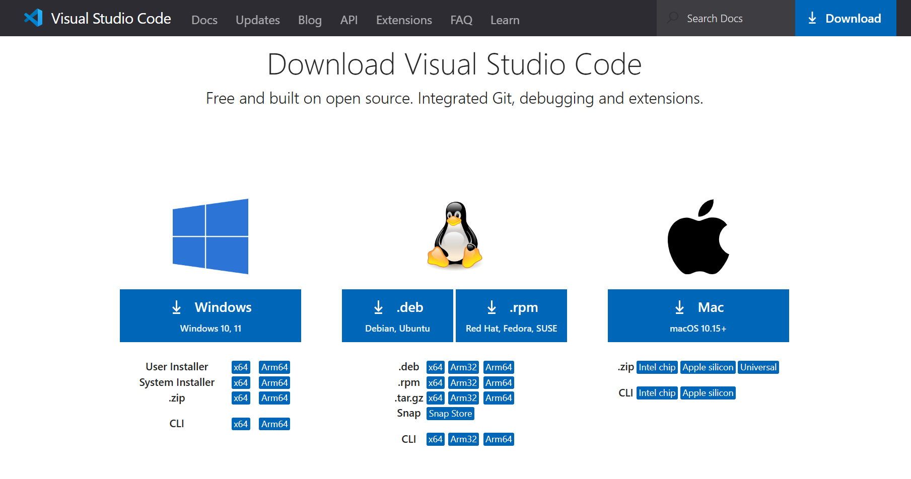
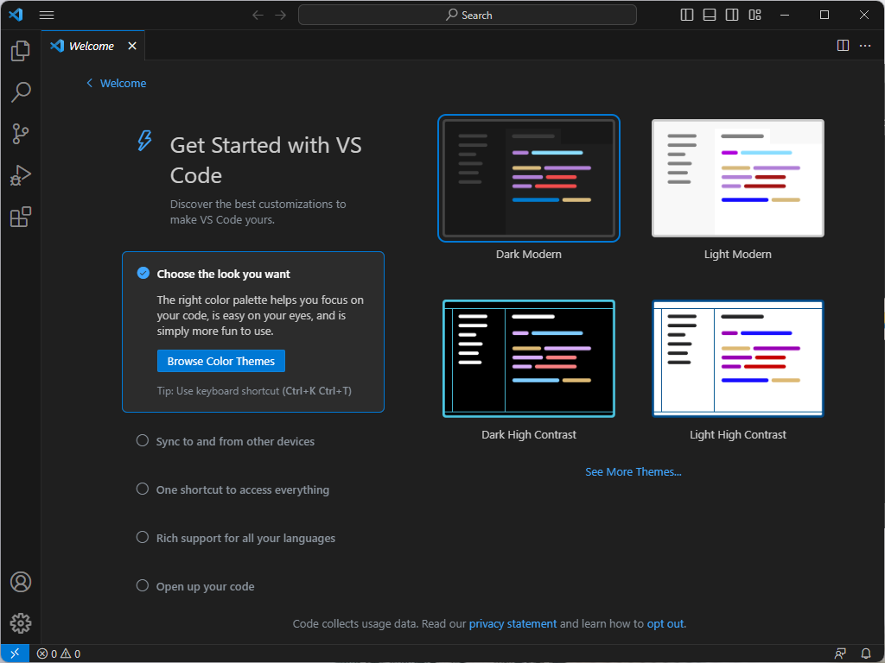
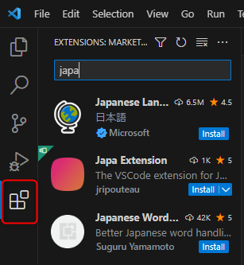

---
var:
  header-title: "オンラインテキストテンプレート"
  header-date: "2024/04/23"
---

## 環境構築

- 環境構築と聞くと、とても面倒な作業だと思うかもしれませんが、HTML、CSS、JavaScriptの場合とても簡単です！

- <u>Visual Studio Codeをインストールします。</u>
- <u>日本語化します。</u>

- たったこれだけで環境構築は終了です！

### インストール

- インストールは[こちら](https://code.visualstudio.com/download)から

- 自分のPCに合ったもの選んでダウンロード・インストールしましょう。

### 日本語化

- インストールが完了したら、このような画像になります。

- ここでは、好きなテーマの色を決めましょう。

- これでインストールは完了しましたが、このままだと英語で使いづらいので、日本語にしましょう。

- 四角が4つ描かれたところをクリックしましょう。

- そして、検索バーに「japanese」と入力し、「Japanese Language Pack for Visual Studio Code」の「install」をクリックします。

- このインストールが完了したら、Visual Studio Codeを再起動しましょう。

- これで日本語化も終わりました。

- これで環境構築は完了です！