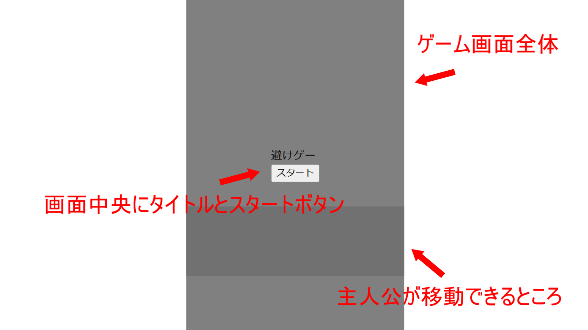

---
var:
  header-title: "オンラインテキストテンプレート"
  header-date: "2024/04/23"
---

# 教育カリキュラム

## まずはステージを作成しよう

### 枠の作成

- まずは、HTMLとCSSを使って簡単なステージを作ってみよう。



```html{.numberLines caption="example01.html"}
<!DOCTYPE html>
<html lang="ja">
<head>
    <meta charset="UTF-8">
    <meta name="viewport" content="width=device-width, initial-scale=1.0">
    <title>Game</title>
</head>
<body>
    <main>
        <div id="mainWindow">

            <div id="targetField"></div>

            <div id="gameTitle">
                <div>避けゲー</div>
                <button id="startButton">スタート</button>
            </div>

        </div>
    </main>
</body>
</html>
```

```css{.numberLines caption="example01.css"}
html,body{
  overflow: hidden;
  height: 100%;
}
       
body {
  margin: 0px;
}

main {
  transform: translateX(50%);
  width: 100%;
  height: 100%;
}

/**ステージの枠*/
#mainWindow {
  background-color: gray;
  height: 100%;
  aspect-ratio: 3 / 5;
  transform: translateX(-50%);
}

/**ゲームタイトルの枠*/
#gameTitle {
  position: absolute;
  top: 50%;
  left: 50%;
  transform: translate(-50%, -50%);
}

/**主人公の移動できる範囲*/
#targetField {
  background-color: rgb(113, 113, 113);
  position: absolute;
  width: 100%;
  height: 100px;
  bottom: 100px;
  z-index: -1;
}
```

- この2つを実行すると、以下のようになります。

<iframe height="300" style="width: 100%; height: 600px;" scrolling="no" title="Untitled" src="https://codepen.io/YasaiRa-men/embed/oNOKKry?default-tab=html%2Cresult&editable=true" frameborder="no" loading="lazy" allowtransparency="true" allowfullscreen="true">
  See the Pen <a href="https://codepen.io/YasaiRa-men/pen/oNOKKry">
  Untitled</a> by バナナフライ (<a href="https://codepen.io/YasaiRa-men">@YasaiRa-men</a>)
  on <a href="https://codepen.io">CodePen</a>.
</iframe>

- スタートボタンがありますが、まだ何も起きません。

### 主人公の作成

- 次に、ボタンが押されたら主人公が出現するようにしよう。
- 主人公は、のちにJavaScriptで操作できるように、"target"というid属性をつけます。

```html{.numberLines caption="example02.html"}
<!DOCTYPE html>
<html lang="ja">
<head>
    <meta charset="UTF-8">
    <meta name="viewport" content="width=device-width, initial-scale=1.0">
    <title>Game</title>
</head>
<body>
    <main>
        <div id="mainWindow">

            <div id="targetField"></div>
            <!-- ここに主人公にするdivを配置 -->
            <div id="target"></div>

            <div id="gameTitle">
                <div>避けゲー</div>
                <button id="startButton">スタート</button>
            </div>

        </div>
    </main>
</body>
</html>
```

- また、主人公には分かりやすいように色を茶色の丸にしておきます。

```css{.numberLines caption="example01.css"}
html,body{
  overflow: hidden;
  height: 100%;
}
       
body {
  margin: 0px;
}

main {
  transform: translateX(50%);
  width: 100%;
  height: 100%;
}

/**ステージの枠*/
#mainWindow {
  background-color: gray;
  height: 100%;
  aspect-ratio: 3 / 5;
  transform: translateX(-50%);
}

/**ゲームタイトルの枠*/
#gameTitle {
  position: absolute;
  top: 50%;
  left: 50%;
  transform: translate(-50%, -50%);
}

/**主人公の移動できる範囲*/
#targetField {
  background-color: rgb(113, 113, 113);
  position: absolute;
  width: 100%;
  height: 100px;
  bottom: 100px;
  z-index: -1;
}

/**主人公*/
#target {
  background-color: brown;
  width: 30px;
  height: 30px;
  border-radius: 50%;
  margin: 0px;
  position: absolute;
}
```

- これによって、このようになりました。

<iframe height="300" style="width: 100%; height: 600px;" scrolling="no" title="Untitled" src="https://codepen.io/YasaiRa-men/embed/pomzzoE?default-tab=html%2Cresult&editable=true" frameborder="no" loading="lazy" allowtransparency="true" allowfullscreen="true">
  See the Pen <a href="https://codepen.io/YasaiRa-men/pen/pomzzoE">
  Untitled</a> by バナナフライ (<a href="https://codepen.io/YasaiRa-men">@YasaiRa-men</a>)
  on <a href="https://codepen.io">CodePen</a>.
</iframe>

- 分かりやすく主人公が出てきましたが、左上にいます。
- これらも自分で設定していかなければなりません。


<iframe height="300" style="width: 100%; height: 600px;" scrolling="no" title="Example_01" src="https://codepen.io/YasaiRa-men/embed/XWQvLRQ?default-tab=html%2Cresult&editable=true" frameborder="no" loading="lazy" allowtransparency="true" allowfullscreen="true">
  See the Pen <a href="https://codepen.io/YasaiRa-men/pen/XWQvLRQ">
  Example_01</a> by バナナフライ (<a href="https://codepen.io/YasaiRa-men">@YasaiRa-men</a>)
  on <a href="https://codepen.io">CodePen</a>.
</iframe>

## 主人公を動かしてみよう

<iframe height="300" style="width: 100%; height: 600px;" scrolling="no" title="Example_02" src="https://codepen.io/YasaiRa-men/embed/QWPeXMx?default-tab=html%2Cresult&editable=true" frameborder="no" loading="lazy" allowtransparency="true" allowfullscreen="true">
  See the Pen <a href="https://codepen.io/YasaiRa-men/pen/QWPeXMx">
  Example_02</a> by バナナフライ (<a href="https://codepen.io/YasaiRa-men">@YasaiRa-men</a>)
  on <a href="https://codepen.io">CodePen</a>.
</iframe>

<iframe height="300" style="width: 100%; height: 600px;" scrolling="no" title="Game" src="https://codepen.io/YasaiRa-men/embed/YzMmoKX?default-tab=html%2Cresult&editable=true" frameborder="no" loading="lazy" allowtransparency="true" allowfullscreen="true">
  See the Pen <a href="https://codepen.io/YasaiRa-men/pen/YzMmoKX">
  Game</a> by バナナフライ (<a href="https://codepen.io/YasaiRa-men">@YasaiRa-men</a>)
  on <a href="https://codepen.io">CodePen</a>.
</iframe>