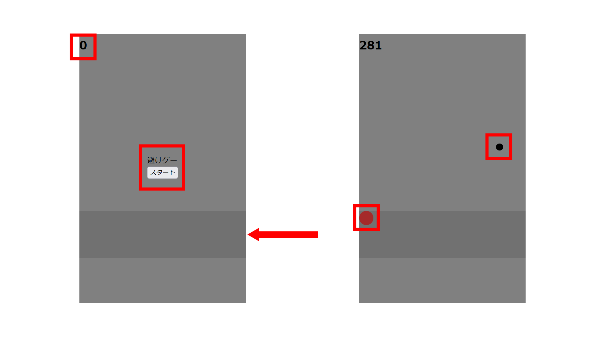

---
var:
  header-title: "オンラインテキストテンプレート"
  header-date: "2024/04/23"
---

# 教育カリキュラム

## はじめに

- htmlは、普通はWebページを作成するために使用されますが、htmlの特徴を利用してゲームにすることができます！



- 上の図の赤の部分のもの自体は全てhtmlの<em>要素</em>によってできています。

- コード上で要素を作成するには、<em><></em>で囲うことで要素と認識されます。

## 見出しタグ

- HTMLには見出しを作成するためのタグがあります。見出しタグは`<h1>`から`<h6>`まであり、数字が小さいほど重要な見出しとなります。

```html{.numberLines caption="example.html"}
<h1>これは見出し1です</h1>
<h2>これは見出し2です</h2>
<h3>これは見出し3です</h3>
<h4>これは見出し4です</h4>
<h5>これは見出し5です</h5>
<h6>これは見出し6です</h6>
```

<iframe height="300" style="width: 100%;" scrolling="no" title="Untitled" src="https://codepen.io/YasaiRa-men/embed/GRaVoYj?default-tab=html%2Cresult&editable=true" frameborder="no" loading="lazy" allowtransparency="true" allowfullscreen="true">
  See the Pen <a href="https://codepen.io/YasaiRa-men/pen/GRaVoYj">
  Untitled</a> by バナナフライ (<a href="https://codepen.io/YasaiRa-men">@YasaiRa-men</a>)
  on <a href="https://codepen.io">CodePen</a>.
</iframe>

## 段落タグ

- 段落を作成するには`<p>`タグを使用します。

```html{.numberLines caption="example.html"}
<p>これは段落です。</p>
<p>もう一つの段落です。</p>
```

<iframe height="300" style="width: 100%;" scrolling="no" title="pタグ" src="https://codepen.io/YasaiRa-men/embed/QWReyZa?default-tab=html%2Cresult&editable=true" frameborder="no" loading="lazy" allowtransparency="true" allowfullscreen="true">
  See the Pen <a href="https://codepen.io/YasaiRa-men/pen/QWReyZa">
  pタグ</a> by バナナフライ (<a href="https://codepen.io/YasaiRa-men">@YasaiRa-men</a>)
  on <a href="https://codepen.io">CodePen</a>.
</iframe>

## 画像タグ

- 画像を表示するには``タグを使用します。

```html{.numberLines caption="example.html"}

```

- src属性で画像のパスを指定し、alt属性で画像の説明を設定します。

## divタグ

- divタグは、HTMLで最も一般的に使用されるコンテナ要素の一つです。divは「division」の略で、文書を論理的なセクションに分割するために使用されます。スタイルやスクリプトの適用を容易にするために、関連する要素をグループ化するのに役立ちます。

- divタグは、その性質上、視覚的な内容を持たないブロックレベルのコンテナです。CSSを使用してスタイルを適用するまでは、ページ上に直接的な表示はありません。

```html{.numberLines caption="example.html"}
<div>
  <p>ここはdivタグで囲まれた段落です。</p>
</div>
```

- 上記の例では、divタグでpタグ（段落）を囲んでいます。これにより、CSSで特定のスタイルを適用する際に、このdiv内の要素だけに影響を与えることができます。

- また、divタグは、Webページのレイアウトを構築する際にも非常に重要です。複数のdivを使用して、ページの異なるセクションを作成し、それぞれに異なるスタイリングを適用することが一般的です。

```html{.numberLines caption="example.html"}
<div class="header">
  <h1>ページのタイトル</h1>
</div>
<div class="content">
  <p>ここにコンテンツが入ります。</p>
</div>
<div class="footer">
  <p>コピーライト情報などをここに配置します。</p>
</div>
```

- この例では、ページのヘッダー、コンテンツ、フッターをそれぞれ異なるdivでマークアップしています。それぞれのdivにはクラス属性が付与されており、CSSを通じて独自のスタイルを適用することができます。

<iframe height="300" style="width: 100%;" scrolling="no" title="Untitled" src="https://codepen.io/YasaiRa-men/embed/JjQjmYw?default-tab=html%2Cresult&editable=true" frameborder="no" loading="lazy" allowtransparency="true" allowfullscreen="true">
  See the Pen <a href="https://codepen.io/YasaiRa-men/pen/JjQjmYw">
  Untitled</a> by バナナフライ (<a href="https://codepen.io/YasaiRa-men">@YasaiRa-men</a>)
  on <a href="https://codepen.io">CodePen</a>.
</iframe>

- ...これでは、いまいちdivについてわかりませんね。

- なので、色分けをしてみます。

<iframe height="300" style="width: 100%;" scrolling="no" title="Untitled" src="https://codepen.io/YasaiRa-men/embed/VwJwEeo?default-tab=html%2Cresult&editable=true" frameborder="no" loading="lazy" allowtransparency="true" allowfullscreen="true">
  See the Pen <a href="https://codepen.io/YasaiRa-men/pen/VwJwEeo">
  Untitled</a> by バナナフライ (<a href="https://codepen.io/YasaiRa-men">@YasaiRa-men</a>)
  on <a href="https://codepen.io">CodePen</a>.
</iframe>

- これだとdivの領域が分かりやすいですね。

- この色分けは、<em>CSS</em>を使いました。次からは、このCSSを学んでいきます。

---

- これで、HTMLの基本的なタグとその使い方について学びました。次回は、HTMLの装飾ができるCSSを学ぼう！