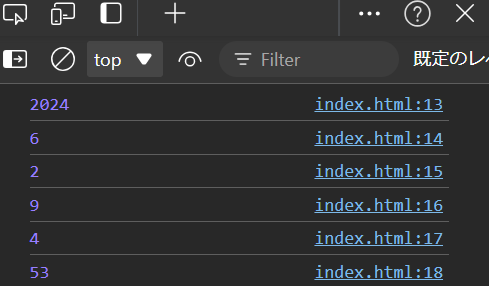

## プロパティ・メソッド

### プロパティとは

- プロパティは、オブジェクトに関連付けられた値を表します。JavaScriptでは、オブジェクトのプロパティには値や関数が含まれることがあります。

```javascript{.numberLines caption="main.js"}
let element = document.getElementById("myElement");
element.textContent = "新しいテキスト";
element.style.color = "red";
```

- 上のコードだと、`textContent`と`color`がプロパティにあたります。

### メソッドとは

- メソッドは、オブジェクトに関連付けられた関数を表します。オブジェクトのメソッドは、そのオブジェクトに対して特定の操作を行うために使用されます。

```javascript{.numberLines caption="main.js"}
let element = document.getElementById("myElement");
element.textContent = "新しいテキスト";
element.style.color = "red";
```

- 上のコードだと、`getElementById("myElement");`がメソッドにあたります。

## プロパティとメソッドの例
 
- 以下は、JavaScriptのオブジェクトである `Date` オブジェクトを使用した例です。`Date` オブジェクトは、日付や時刻に関連するプロパティとメソッドが多数含まれています。

```javascript{.numberLines caption="main.js"}
let today = new Date(); // Dateオブジェクトのインスタンスを作成
console.log(today.getFullYear()); // 現在の年を取得
console.log(today.getMonth()); // 現在の月を取得 (0から始まる)
console.log(today.getDate()); // 現在の日を取得
console.log(today.getHours()); // 現在の時を取得
console.log(today.getMinutes()); // 現在の分を取得
console.log(today.getSeconds()); // 現在の秒を取得
```

- この例では、`Date` オブジェクトのメソッドを使用して、現在の日付と時刻の各部分を取得しています。これのメソッドは、特定のオブジェクトに関連する操作を行うために設計されています。



html_1

<div class="note type-quiz">
Q. ここにゲームの進行の手伝いになるようなお題を入れる
divの中にdivを作ってみようみたいな
```html{caption="index.html"}
<body>
  <div>
  </div>
</body>
```
<div class="quizes">
<div class="options">
  <div class="option correct">答えを見る</div>
</div>
<div class="answercontent">
答えの一例です。

</div>
</div>
</div>