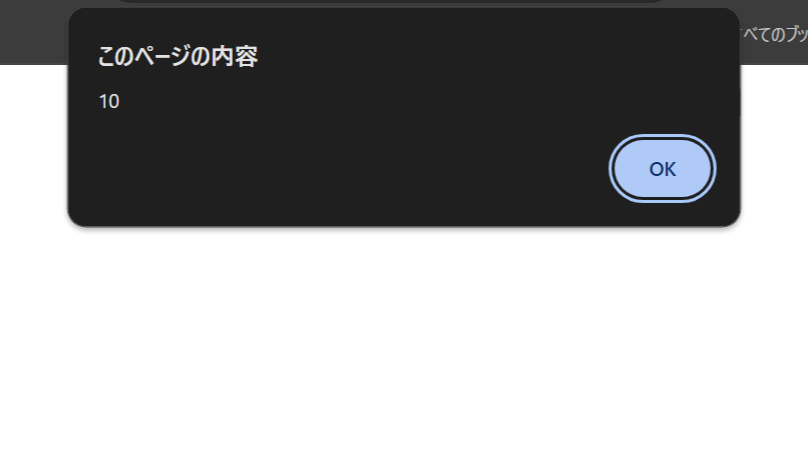
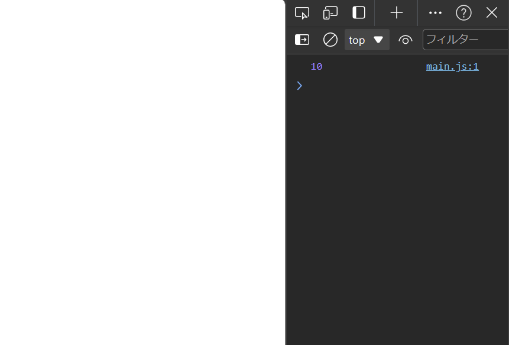
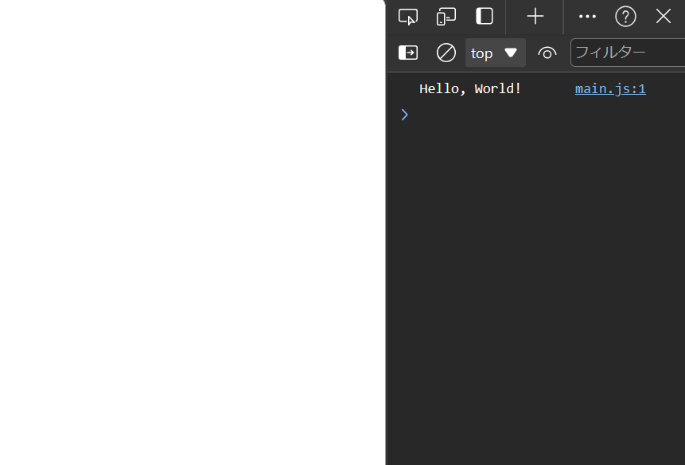

---
var:
  header-title: "オンラインテキストテンプレート"
  header-date: "2024/04/23"
---

# 教育カリキュラム

## 概要

### 前回の復習

- CSSの装飾について学んだ

### 今回の講義の達成目標

<div class="note type-intro">
**達成目標**

・JavaScriptの基本的な記述方法を学ぼう。

</div>

## はじめに

- 今回は、JavaScriptの基礎について学ぶ。
- HTMLに動的な動作を加えるには、<u>JavaScript</u>を使うと便利である。
- ひとまず、JavaScriptが動作するかの確認をしてみよう。

- これまで作成してきたファイルを同じ手順で、HTMLがあるフォルダーと同じ階層に**main.js**という名前のファイルを作成しよう。
拡張子が**.js**となるものがJavaScriptとして認識されます。

- 試しに、作ったJavaScriptファイルに、このように書いてみよう。
(詳しい説明は後ほど行います)

```javascript{.numberLines caption="main.js"}
alert(10);
```

- ただし、これだけでは、HTMLにこのJavaScriptファイルを読み込んでくれない。
なので、HTMLの**body**内にこのように書いて読み込ませる必要がある。

```html{caption="index.html"}
<script src="main.js"></script>
```

- この**script**タグで、JavaScriptを読み込んでくれるようになり、**src**属性で、どのJavaScriptファイルを読み込むかを記述する。

---

- このHTMLを読み込むと、以下の画像のようなものが表示される。
この画面が表示されたら成功である。



<div class="note type-tips">
表示される画面はブラウザによって異なるが、**10**が表示されていればOK
</div>

ここで、次に先程のJavaScriptファイルをこのように変えてみよう。

```javascript{.numberLines caption="main.js"}
alert(30);
```

- 10だったところを30に変えてみた。
こうするとどうなるか予想してみよう！

- 答え
<span class="masked">
10の表示が30に変わる
</span>

---

- とりあえず今は<br><em>「alert();と書いて、括弧の中に書いたものが表示される」</em>という考え方でOK

<div class="note type-quiz">
Q. このように記述すると、以下のどれが表示されるか選べ。
```javascript{.numberLines caption="main.js"}
alert(100);
```
<div class="quizes">
<div class="options">
<div class="option incorrect">1</div>
  <div class="option incorrect">10</div>
  <div class="option correct">100</div>
  <div class="option incorrect">1000</div>
</div>
<div class="answercontent">
括弧の中に書いたものが表示されるため、<u>100</u>が正解です。
</div>
</div>

</div>


## 変数

- プログラミングにおいて、変数はデータを格納するための箱のようなものです。変数には値を代入して保持し、後でその値を参照したり変更したりすることができます。

- JavaScriptでは、変数を宣言する際、 `let` や `const`、`var` のキーワードを使用します。それぞれの違いについては後述します。

- 例えば、以下のように変数を宣言して値を代入することができます。

```javascript{.numberLines caption="main.js"}
let age = 30; // 数値型の変数
let name = "Alice"; // 文字列型の変数
const PI = 3.14; // 定数の宣言
```

- 変数を使用することで、同じ値を繰り返し使用したり、値を保持しておいて後で利用することができます。

### 変数の種類

1. `let`: 変数を宣言する際に使用されるキーワード。再代入が可能な変数を宣言する際に使用します。

2. `const`: 定数を宣言する際に使用されるキーワード。一度値を代入すると後から変更できません。

3. `var`: 古いバージョンのJavaScriptで使用されていた変数宣言キーワード。`let` や `const` の使用が推奨されています。

- 変数を使うことで、データを保持し、処理を行う際に柔軟に値を扱うことができます。次のセクションでは、変数を使用した実践的な例を見ていきましょう。

```javascript{.numberLines caption="main.js"}
let age = 30; // 数値型の変数
console.log(age); // --> 30
```

- このように記述すると、先程宣言したageの内容が出力されます。

- そうです。<u>宣言した内容を記憶してくれます。</u>

- また、``let``だと、後ほど変更することも可能です。

```javascript{.numberLines caption="main.js"}
let age = 30; // 数値型の変数
console.log(age); // -->30

age = 31;
console.log(age); // -->31
```

### letとconstの違い

- letは、宣言した後でも、後ほど変更することが可能ですが、constは、<u>一度宣言すると内容を変更することができません。</u>
変更されることがないようなときに使用します。

```javascript{.numberLines caption="main.js"}
const age = 30; // 数値型の定数
console.log(age); // -->30

age = 31; // --> エラー
console.log(age);
```

<div class="note type-quiz">
Q. このように記述すると、以下のどれがコンソールに表示されるか予想してみよう。
```javascript{.numberLines caption="main.js"}
let a = 0;
console.log(A);
```
<div class="quizes">
<div class="options">
  <div class="option incorrect">0</div>
  <div class="option incorrect">A</div>
  <div class="option correct">エラー</div>
</div>
<div class="answercontent">
実は、変数は大文字と小文字も区別します。そのためAという変数が宣言されておらず、「Aが定義されていない」というエラーが表示されます。
</div>
</div>

</div>

## 数値型

### 数値型とは

- さて、先程「10」や「30」と入力してきましたが、これらのことをプログラミングでは<em>数値型</em>と言います。

- それでは、今度は四則演算を行っていきたいのですが、その前に今度は``console.log();``というものを使っていきます。

- ひとまず、以下のコードを書いてみよう。
```javascript{.numberLines caption="main.js"}
console.log(10);
```

- これを保存してHTMLを読み込んでも、一見変化がないように見える。
- ここで、``F12キー``を押してみよう。すると、いかにも「自分プログラミングしてる！」て感じの画面が出てきます。(初回は開くかどうか尋ねられることもあるので、その場合は許可をしよう)



- そして、ここに表示されている「10」が、今回私たちが入力したものである。
この画面のことを<em>コンソール</em>と言う。

### 加算と減算

- 足し算をしたい場合は`+`、引き算は`-`を使用する。
```javascript{.numberLines caption="main.js"}
console.log(10 + 2); // --> 12
console.log(10 - 2); // --> 8
```

### 乗算

- かけ算をしたい場合は×... と思いきや`*`(アスタリスク)を使用する。
```javascript{.numberLines caption="main.js"}
console.log(10 * 2); // --> 20
```

### 割り算

- 割り算をしたい場合は`/`を使用する。
```javascript{.numberLines caption="main.js"}
console.log(10 / 2); // --> 5
```

### 余り(余剰)

- 割り算をしたときの余りが欲しい場合は`%`を使用する。
```javascript{.numberLines caption="main.js"}
console.log(10 % 2); // --> 0
```

### 四則演算のルール

- 計算に関しては、括弧を使うことで、加算・減算を優先させることができる。
```javascript{.numberLines caption="main.js"}
console.log( 1 + 2  * 3); // --> 7
console.log((1 + 2) * 3); // --> 9
```

<br>

<div class="note type-caution">
括弧が重なる場合でも、中括弧や大括弧は使用せず、全て括弧で囲おう。
中括弧や大括弧だと別の意味として扱われてしまいます。
<br>
例：{(1 + 2) / 3} × 4 (= 4)を計算したい場合
```javascript{.numberLines caption="main.js"}
console.log( {(1 + 2) / 3} * 4 ); // --> エラー
console.log( ((1 + 2) / 3) * 4 ); // --> 4
```
</div>

<br>

<div class="note type-quiz">
Q. このように記述すると、以下のどれがコンソールに表示されるか選べ。
```javascript{.numberLines caption="main.js"}
console.log((300 + 20) % 10);
```
<div class="quizes">
<div class="options">
  <div class="option incorrect">320</div>
  <div class="option incorrect">32</div>
  <div class="option correct">0</div>
  <div class="option incorrect">3</div>
</div>
<div class="answercontent">
300 + 20は320となり、そこから10で割った余り(余剰)を出力するので、答えは<u>0</u>となります。
</div>
</div>

</div>

## 文字列

- 数字ばかり出力させても面白くないですよね。ということで、次は文字を出力させてみよう！(文字も面白いかと言われると微妙だけど...)

### 文字列とは

- プログラミングにて、文字のことを<em>文字列</em>と言います。

- JavaScriptにおける文字列とは、テキストデータを表現するためのデータ型です。文字列は、シングルクォート ``'`` もしくはダブルクォート ``"`` で囲むことで表現されます。

- 試しに、「Hello, World!」という文字をコンソールに出力してみましょう。

```javascript{.numberLines caption="main.js"}
console.log("Hello, World!");
```

- これでHTMLを開くと、このようになる。



- ``'``や``"``で囲ったものを文字列として扱われます。

<div class="note type-senior">
「'」や「"」を文字列として扱うには

主なやり方は2種類あります。

1. 囲ったものはもう片方の方で記述する。
```javascript{.numberLines caption="main.js"}
// シングルクォートで囲った場合はダブルクォートで
console.log('A"B"C'); // --> A"B"C

// ダブルクォートで囲った場合はシングルクォートで
console.log("I'm fine."); // --> I'm fine.
```

2. <em>バックスラッシュ\\</em>を手前に書く。
```javascript{.numberLines caption="main.js"}
console.log("A\"B\'C"); // --> A"B'C
```

</div>

## 関数

### 関数の基本

- プログラミングにおいて、関数は特定の処理をまとめて再利用可能な形で定義するための仕組みです。関数を使用することで、同じ処理を繰り返し記述する必要がなくなり、コードの再利用性や保守性が向上します。

- JavaScriptにおいて、関数は以下のように定義されます。

```javascript{.numberLines caption="main.js"}
// 関数の宣言
function greet() {
  console.log("Hello, World!");
}

// 関数の呼び出し
greet();
```

- 上記の例では、`greet` という関数が定義されており、その中で `"Hello, World!"` というメッセージがコンソールに出力されます。関数を呼び出すことで、定義された処理が実行されます。

### 関数のパラメータと戻り値

関数名の括弧内に変数を書くことで、その関数内でその変数を使用することができます。
<em>これをパラメータ(引数)</em>と言います。

```javascript{.numberLines caption="main.js"}
// 関数の宣言
function greet(p) {
  console.log(p);
}

// 関数の呼び出し
greet("Hello, World!");　// --> Hello, World!
```

- 関数はパラメータを受け取り、処理を行った結果を<em>戻り値</em>として返すことができます。パラメータは関数に渡す値であり、戻り値は関数から返される値です。

- 以下は、パラメータと戻り値を持つ関数の例です。

```javascript{.numberLines caption="main.js"}
function add(a, b) {
  // returnの内容が結果として出るようになる
  return a + b;
}

let result = add(5, 3);
console.log(result); // --> 8
```

- 上記の例では、`add` という関数が定義されており、2つのパラメータ `a` と `b` を受け取り、それらを足した結果を戻り値として返しています。関数を呼び出す際に引数として `5` と `3` を渡し、結果 `8` がコンソールに出力されます。

### 関数のスコープ

- 関数内で宣言された変数はその関数内でのみ有効であり、関数外からはアクセスできません。これを関数スコープと呼びます。

- 関数スコープを示す例を以下に示します。

```javascript{.numberLines caption="main.js"}
function greet() {
  let message = "Hello, World!";
  console.log(message);
}

greet();
console.log(message); // -- > エラー
```

- 上記の例では、`message` 変数は `greet` 関数内で定義されており、関数外からはアクセスできません。関数スコープによって変数のスコープが制限されることで、変数名の衝突や意図しない変更を防ぐことができます。

ここで、変数と関数の基本的な解説は終了です。